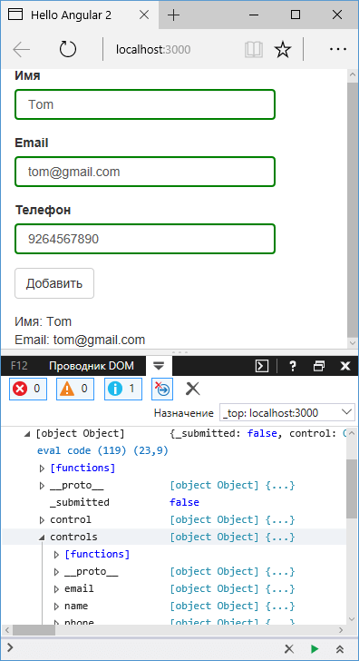

# Директива NgForm

Как правило, при работе с формами все элементы ввода не определяются сами по себе, а помещаются в стандартный элемент формы - `<form></form>`. Применение данного элемента позволяет управлять всеми элемента ввода вцелом как одной общей формой.

Непосредственно в Angular для работы с формой определена специальная директива **`NgForm`**. Она создает объект `FormGroup` и привязывает его к форме, что позволяет отслеживать состояние формы, управлять ее валидацией.

Мы можем применить данную директиву, определив переменную в теге формы:

```html
<form #myForm="ngForm"></form>
```

Хотя при использовании формы подобные переменные, которые представляет всю форму, применять необязательно, но, используя их, мы можем получить некоторые дополнительные возможности. В частности, через переменную получить статус формы.

К примеру, определим в шаблоне компонента `AppComponent` следующую форму:

```typescript
import { Component } from '@angular/core'
import { NgForm } from '@angular/forms'

@Component({
  selector: 'my-app',
  styles: [
    `
      input.ng-touched.ng-invalid {
        border: solid red 2px;
      }
      input.ng-touched.ng-valid {
        border: solid green 2px;
      }
    `
  ],
  template: `
    <form #myForm="ngForm" novalidate>
      <div class="form-group">
        <label>Имя</label>
        <input class="form-control" name="name" [(ngModel)]="name" required />
      </div>
      <div class="form-group">
        <label>Email</label>
        <input class="form-control" name="email" ngModel required email />
      </div>
      <div class="form-group">
        <label>Телефон</label>
        <input
          class="form-control"
          name="phone"
          ngModel
          required
          pattern="[0-9]{10}"
        />
      </div>
      <div class="form-group">
        <button
          [disabled]="myForm.invalid"
          class="btn btn-default"
          (click)="submit(myForm)"
        >
          Добавить
        </button>
      </div>
    </form>
    <div>Имя: {{ myForm.value.name }}</div>
    <div>Email: {{ myForm.value.email }}</div>
  `
})
export class AppComponent {
  submit(form: NgForm) {
    console.log(form)
  }
}
```

Чтобы задействовать директиву `NgForm`, это импортировать ее из пакета `@angular/forms`:

```typescript
import { NgForm } from '@angular/forms'
```

У формы определена переменная `#myForm`. Причем она инициализирована значением `ngForm`. То есть эта переменная `myForm` представляет директиву `NgForm`, и через эту переменную мы сможем ссылаться на всю форму.

Хотя мы явно не добавляли директиву `NgForm`, Angular 2 автоматически сам добавляет ее в тег формы. Данная директива добавляет элемену `form` ряд дополнительных возможностей. В частности, она инкапсулирует все элементы формы, к которым применяется директива `ngModel`, и позволяет получить доступ к состоянию этих элементов, в том числе проверить введенные данные на корректность. Так, для отслеживания состояния Angular добавляет к тегу форму ряд классов:

```html
<form class="ng-pristine ng-untouched ng-valid" novalidate=""></form>
```

`ng-pristine`, `ng-untouched`, `ng-valid` - это те же классы, которые применяются к элементам управления и которые были рассмотрены в прошлой теме.

Затем мы можем использовать форму. Прежде всего для ее валидации. Во-первых, к форме применяется атрибут `novalidate`. Этот атрибут отключает отображение встроенных в браузер сообщений об ошибках валидациию. Ведь в нашем случае мы полагаемся на механизм валидации в Angular 2. И, как показывает практика, не всегда валидная форма с точки зрения Angular 2, является валидной и с точки зрения браузера.

Во-вторых, используя состояние формы, мы можем отключить кнопку и соответственно предотвратить некоторые действия по нажатию на нее:

```html
<button [disabled]="myForm.invalid"></button>
```

И также в методе `submit()`, который вызывается при нажатии на кнопку, можно получить всю форму и ее значения:

```typescript
onSubmit(myForm: NgForm){

    console.log(myForm);
}
```

К элементам формы применяется директива `ngModel`. Причем только в одном случае используется выражение привязки. Использовать привязку с паре с `ngModel` в принципе необязательно, хотя, как правило, используется двусторонняя привязка. Данная же директива просто указывает, что поле ввода, к которому она применяется, будет включаться в объект `myForm`.

При работе с переменной `myForm` следует учитывать, что она представляет сложный объект, который инкапсулирует всю информацию о форме:



К примеру, через свойство `controls` мы можем обратиться к элементам формы, к которым применена директива `ngModel`. Причем названия этих элементов соответствуют значениям атрибутов `name` у полей ввода.

Для получения введенных значений мы также можем использовать свойство `value`:

```html
<div>Имя: {{myForm.value.name}}</div>
<div>Email: {{myForm.value.email}}</div>
```

Но стоит отметить, что наличие доступ к соответствующему элементу возможен, только если к этому элементу применяется директиву `ngModel`, как в случае выше.

## Отправка формы

После заполнения формы пользователь отправляет ее обычно с помощью нажатия на кнопку отправки (`<input type="submit">`), которая, как правило, помещается в самом низу формы. Но в Angular для управления отправкой формы мы можем использовать событие `ngSubmit`, которое генерируется при нажатии на кнопку отправки:

```typescript
import { Component } from '@angular/core'
import { NgForm } from '@angular/forms'

@Component({
  selector: 'my-app',
  styles: [
    `
      input.ng-touched.ng-invalid {
        border: solid red 2px;
      }
      input.ng-touched.ng-valid {
        border: solid green 2px;
      }
    `
  ],
  template: `
    <form #myForm="ngForm" novalidate (ngSubmit)="onSubmit(myForm)">
      <div class="form-group">
        <label>Имя</label>
        <input class="form-control" name="name" ngModel required />
      </div>
      <div class="form-group">
        <label>Email</label>
        <input class="form-control" name="email" ngModel required email />
      </div>
      <div class="form-group">
        <label>Телефон</label>
        <input
          class="form-control"
          name="phone"
          ngModel
          required
          pattern="[0-9]{10}"
        />
      </div>
      <div class="form-group">
        <input
          type="submit"
          [disabled]="myForm.invalid"
          class="btn btn-default"
          value="Отправить"
        />
      </div>
    </form>
  `
})
export class AppComponent {
  onSubmit(form: NgForm) {
    console.log(form)
  }
}
```

В данном случае при генерации этого события будет срабатывать метод `onSubmit()`, который определен в компоненте. Используя этот метод, мы можем либо тут же обработать отправляемые данные, либо провести какую-то предобработку до отправления дальше на сервер.
