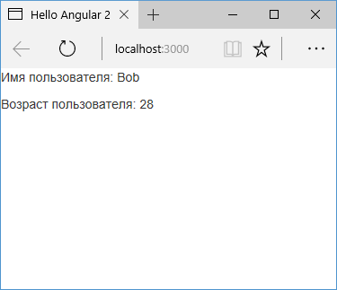
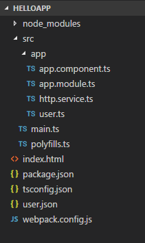

# HttpClient и отправка запросов

Для взаимодействия с сервером и отправки запросов по протоколу HTTP применяется класс **`HttpClient`**. Этот класс определяет ряд методов для отправки различного рода запросов: `GET`, `POST`, `PUT`, `DELETE`. Данный класс построен поверх стандартного объекта в JavaScript - `XMLHttpRequest`.

Для использования этого класса в проект необходимо установить пакет `@angular/common`:

```json
{
  "name": "helloapp",
  "version": "1.0.0",
  "description": "First Angular 7 Project",
  "author": "Eugene Popov <metanit.com>",
  "scripts": {
    "dev": "webpack-dev-server --hot --open",
    "build": "webpack"
  },
  "dependencies": {
    "@angular/common": "~7.0.0"
    // остальные пакеты
  },
  "devDependencies": {
    // остальные пакеты
  }
}
```

И также в файле модуля `AppModule` должен быть импортирован класс `HttpClientModule` из пакета `@angular/common/http`:

```typescript
import { NgModule } from '@angular/core'
import { BrowserModule } from '@angular/platform-browser'
import { FormsModule } from '@angular/forms'
import { AppComponent } from './app.component'

import { HttpClientModule } from '@angular/common/http'

@NgModule({
  imports: [BrowserModule, FormsModule, HttpClientModule],
  declarations: [AppComponent],
  bootstrap: [AppComponent]
})
export class AppModule {}
```

Стоит отметить, что в предыдущих версиях Angular (2,4) использовался для взаимодействия с сетью тип `HttpModule` из пакета `@angular/http`. Начиная с версии Angular 5 тип `HttpModule` и вообще пакет `@angular/http` являются устаревшими, поэтому рекомендуется применять именно классы `HttpClient` и `HttpClientModule`, которые собственно и используются в данном руководстве.

Вначале рассмотрим выполнение простейших GET-запросов. Пусть у нас есть стандартная структура проекта:


В корневую папку проекта добавим файл `user.json`, который будет представлять данные:

```json
{
  "name": "Bob",
  "age": 28
}
```

Для представления данных в папку `src/app` добавим новый файл `user.ts` и определим в нем следующий код:

```typescript
export class User {
  name: string
  age: number
}
```

Для оправки запроса определим в компоненте `AppComponent` следуюший код:

```typescript
import { Component, OnInit } from '@angular/core'
import { HttpClient } from '@angular/common/http'
import { User } from './user'

@Component({
  selector: 'my-app',
  template: `
    <div>
      <p>Имя пользователя: {{ user?.name }}</p>
      <p>Возраст пользователя: {{ user?.age }}</p>
    </div>
  `
})
export class AppComponent implements OnInit {
  user: User

  constructor(private http: HttpClient) {}

  ngOnInit() {
    this.http.get('user.json').subscribe((data: User) => (this.user = data))
  }
}
```

В данном случае в шаблоне выводятся данные объекта `User`, которые мы хотим получить с сервера. Однако загрузка данных, скажем, в конструкторе компонента не очень желательна. В этом плане метод `ngOnInit()`, который определен в интерфейсе `OnInit` и который вызывается при инициализации компонента представляет более предпочтительное место для загрузки данных. В конструкторе же мы просто получаем сервис `HttpClient`.

Далее в методе `ngOnInit()` получаем данные из сервиса. Сам метод `http.get()` возвращает объект `Observable<any>`. `Observable` представляет своего рода поток, и для прослушивания событий из этого потока применяется метод `subscribe`. Этот метод определяет действие над результатом запроса - полученными с сервера данными. В данном случае действие определено в виде стрелочной функции. Причем поскольку между схемой класса `User` и данными из файла `json` есть прямое сопоставление, то получаемые данные мы можем определить как объект `User`, и присвоить их переменной данного класса:

```typescript
;(data: User) => (this.user = data)
```

В итоге при запуске веб-страницы мы увидим загруженные данные из файла `user.json`.



## Создание сервиса

При взаимодействии с сервером, как правило, обращения к серверу происходят не непосредственно из компонента, а из вспомогательных сервисов. Поскольку сервис может определять дополнительную логику обработки полученных с сервера данных, которую могли бы сделать код компонента перегруженным. Кроме того, сервисы могут определять функционал, который будет использоваться несколькими компонентами. Компоненты же выступают в качестве потребителей данных, которые получены от сервисов.

Поэтому для работы с `http` добавим в папку `src/app` новый файл `http.service.ts` со следующим содержимым:

```typescript
import { Injectable } from '@angular/core'
import { HttpClient } from '@angular/common/http'

@Injectable()
export class HttpService {
  constructor(private http: HttpClient) {}

  getData() {
    return this.http.get('user.json')
  }
}
```

Для отправки запросов сервис получает объект `HttpClient`. Поскольку сервис принимает в конструкторе параметр через механизм dependency injection, то к классу применяется декоратор `@Injectable`.

Для выполнения get-запроса у объекта `HttpClient` вызывается метод `get()`, в который передается адрес запроса - в нашем случае json-файл с данными.

В итоге структура проекта будет выглядеть следующим образом:



Теперь используем этот сервис в компоненте `AppComponent`:

```typescript
import { Component, OnInit } from '@angular/core'
import { HttpService } from './http.service'
import { User } from './user'

@Component({
  selector: 'my-app',
  template: `
    <div>
      <p>Имя пользователя: {{ user?.name }}</p>
      <p>Возраст пользователя: {{ user?.age }}</p>
    </div>
  `,
  providers: [HttpService]
})
export class AppComponent implements OnInit {
  user: User

  constructor(private httpService: HttpService) {}

  ngOnInit() {
    this.httpService.getData().subscribe((data: User) => (this.user = data))
  }
}
```

## Загрузка сложных данных

В примерах выше определение json-файла соответствует определению класса `User`, поэтому простое присвоение `this.user=data` пройдет успешно. И подобным образом мы можем загружать и другие более сложные данные. Например, определим в корневой папке проекта файл `users.json`:

```json
{
  "userList": [
    {
      "name": "Bob",
      "age": 28
    },
    {
      "name": "Tom",
      "age": 45
    },
    {
      "name": "Alice",
      "age": 32
    }
  ]
}
```

Изменим в классе `HttpService` адрес загрузки данных:

```typescript
getData(){
        return this.http.get('users.json')
}
```

И изменим код компонента:

```typescript
import { Component, OnInit } from '@angular/core'
import { HttpService } from './http.service'
import { User } from './user'

@Component({
  selector: 'my-app',
  template: `
    <ul>
      <li *ngFor="let user of users">
        <p>Имя пользователя: {{ user?.name }}</p>
        <p>Возраст пользователя: {{ user?.age }}</p>
      </li>
    </ul>
  `,
  providers: [HttpService]
})
export class AppComponent implements OnInit {
  users: User[] = []

  constructor(private httpService: HttpService) {}

  ngOnInit() {
    this.httpService
      .getData()
      .subscribe(data => (this.users = data['userList']))
  }
}
```

В данном случае мы хотим получить массив объектов `User`. Но напрямую данные из `users.json` не соответствуют массиву. Массив в файле определен по ключу `userList`. Поэтому, используя данный ключ, мы достаем нужные данные из ответа сервера: `this.users=data["userList"]`.


