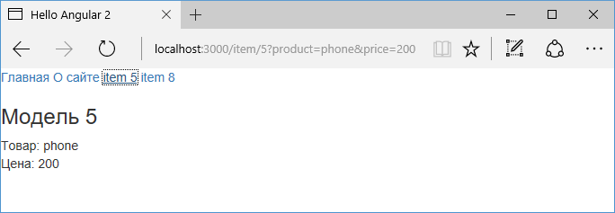

# Параметры строки запроса

Кроме параметров маршрута в запросе могут передаваться параметры строки запроса. Например, в запросе `http://localhost:3000/item?product=phone&price=200` часть `product=phone&price=200` будет представлять параметры запроса - `product` и `price`. Такие параметры помещаются в конце адреса после вопросительного знака и разделяются амперсандом.

Параметры строки запроса не влияют на определение маршрутов, и их количество произвольно. Так, для работы возьмем проект из прошлой темы. В этом проекте определен компонент `ItemComponent`, который получает параметр маршрута. Добавим в него также получения параметров из строки запроса:

```typescript
import { Component } from '@angular/core'
import { ActivatedRoute } from '@angular/router'
import { Subscription } from 'rxjs'

@Component({
  selector: 'item-info',
  template: `
    <h3>Модель {{ id }}</h3>
    <div>Товар: {{ product }}</div>
    <div>Цена: {{ price }}</div>
  `
})
export class ItemComponent {
  private id: number
  private product: string
  private price: string

  private routeSubscription: Subscription
  private querySubscription: Subscription
  constructor(private route: ActivatedRoute) {
    this.routeSubscription = route.params.subscribe(params => (this.id = params['id']))
    this.querySubscription = route.queryParams.subscribe((queryParam: any) => {
      this.product = queryParam['product']
      this.price = queryParam['price']
    })
  }
}
```

Для хранения полученных параметров определены свойства `product` и `price`. Получение параметров из строки запроса аналогично получению данных из маршрута, только в данном случае применяется свойство `queryParams` класса `ActivatedRoute`.

И как и в случае с параметрами маршрута, результатом вызова `route.queryParams.subscribe()` является объект `Subscription`, который необходимо удалять при удалении компонента в методе `ngOnDestroy`.

И после этого мы сможем передавать через строку запроса данные в `ItemComponent`, например, с помощью запроса `http://localhost:3000/item/5?product=phone&price=200`.

Теперь изменим код `AppComponent`, определив ссылки с параметрами:

```typescript
import { Component } from '@angular/core'

@Component({
  selector: 'my-app',
  template: `
    <div>
      <nav>
        <a routerLink="">Главная</a>
        <a routerLink="/about">О сайте</a>
        <a [routerLink]="['item', '5']" [queryParams]="{ product: 'phone', price: 200 }">item 5</a>
        <a [routerLink]="['item', '8']" [queryParams]="{ product: 'tablet' }">item 8</a>
      </nav>
      <router-outlet></router-outlet>
    </div>
  `
})
export class AppComponent {}
```

Для передачи параметров к ссылке применяется директива `queryParams`, которая принимает javascript-объект.


