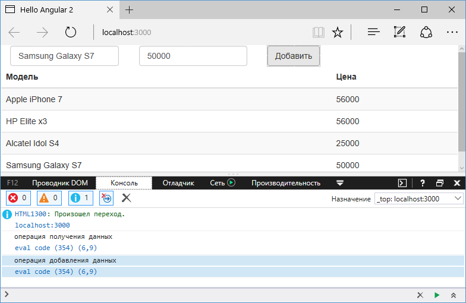

# Внедрение сервиса в другой сервис

Вполне вероятна ситуация, когда мы захотим использовать один сервис в другом сервисе. Например, в прошлой теме был создан сервис для работы с данными. Что если нам необходимо логгировать все операции с данными. Для логгирования определим новый сервис. Для этого добавим в папку `src/app` новый файл `log.service.ts` со следующим содержимым:

```typescript
export class LogService {
  write(logMessage: string) {
    console.log(logMessage)
  }
}
```

Для логгирования в сервисе определен метод `write`, который выводит некоторое сообщение на консоль.

Теперь используем этот сервис. Для этого изменим код в файле `data.service.ts`:

```typescript
import { Injectable } from '@angular/core'
import { Phone } from './phone'
import { LogService } from './log.service'

@Injectable()
export class DataService {
  private data: Phone[] = [{ name: 'Apple iPhone 7', price: 56000 }, { name: 'HP Elite x3', price: 56000 }, { name: 'Alcatel Idol S4', price: 25000 }]
  constructor(private logService: LogService) {}

  getData(): Phone[] {
    this.logService.write('операция получения данных')
    return this.data
  }
  addData(name: string, price: number) {
    this.data.push(new Phone(name, price))
    this.logService.write('операция добавления данных')
  }
}
```

Чтобы указать, что сервис сам может использовать другие сервисы, к классу сервиса применяется декоратор `@Injectable`. Если класс не будет иметь подобного декоратора, то встроенный механизм внедрения зависимостей не сможет создать объект этого класса и выдаст ошибку.

Существует общая рекомендации от разработчиков Angular применять `@Injectable` к любому классу сервиса, хотя в принципе это необязательно.

Хотя в прошлой теме мы могли использовать сервис в компоненте без применения к компоненту декоратора `@Injectable`. Дело в том, что декоратор `@Component`, который применяется к компоненту, является подтипом `@Injectable`.

И также в случае с `DataService` сервис `LogService` также надо зарегистрировать в списке провайдеров `AppComponent`:

```typescript
import { Component, OnInit } from '@angular/core'
import { DataService } from './data.service'
import { LogService } from './log.service'
import { Phone } from './phone'

@Component({
  selector: 'my-app',
  template: `
    <div class="panel">
      <div class="form-inline">
        <div class="form-group">
          <div class="col-md-8">
            <input class="form-control" [(ngModel)]="name" placeholder="Модель" />
          </div>
        </div>
        <div class="form-group">
          <div class="col-md-6">
            <input type="number" class="form-control" [(ngModel)]="price" placeholder="Цена" />
          </div>
        </div>
        <div class="form-group">
          <div class="col-md-offset-2 col-md-8">
            <button class="btn btn-default" (click)="addItem(name, price)">Добавить</button>
          </div>
        </div>
      </div>
      <table class="table table-striped">
        <thead>
          <tr>
            <th>Модель</th>
            <th>Цена</th>
          </tr>
        </thead>
        <tbody>
          <tr *ngFor="let item of items">
            <td>{{ item.name }}</td>
            <td>{{ item.price }}</td>
          </tr>
        </tbody>
      </table>
    </div>
  `,
  providers: [DataService, LogService]
})
export class AppComponent implements OnInit {
  items: Phone[] = []
  constructor(private dataService: DataService) {}

  addItem(name: string, price: number) {
    this.dataService.addData(name, price)
  }
  ngOnInit() {
    this.items = this.dataService.getData()
  }
}
```

И несмотря на то, что напрямую `LogService` не используется в компоненте `AppComponent`, но он используется в `DataService`, который вызывается в `AppComponent`.

И при выполнении операций с данными в консоли браузера мы сможем увидеть работу сервиса `LogService`.


