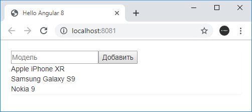

# Сервисы

Сервисы в Angular представляют довольно широкий спектр классов, которые выполняют некоторые специфические задачи, например, логгирование, работу с данными и т. д.

В отличие от компонентов и директив сервисы не работают с представлениями, то есть с разметкой html, не оказывают на нее прямого влияния. Они выполняют строго определенную и достаточно узкую задачу.

Стандартные задачи сервисов:

- Предоставление данных приложению. Сервис может сам хранить данные в памяти, либо для получения данных может обращаться к какому-нибудь источнику данных, например, к серверу.
- Сервис может представлять канал взаимодействия между отдельными компонентами приложения
- Сервис может инкапсулировать бизнес-логику, различные вычислительные задачи, задачи по логгированию, которые лучше выносить из компонентов. Тем самым код компонентов будет сосредоточен непосредственно на работе с представлением. Кроме того, тем самым мы также можем решить проблему повторения кода, если нам потребуется выполнить одну и ту же задачу в разных компонентах и классах.

Допустим, у нас есть следующая базовая структура проекта:


Добавим в папку `src/app` новый файл, который назовем `phone.ts`. Определим в этом файле следующий класс:

```typescript
export class Phone {
  constructor(public name: string, public price: number) {}
}
```

Этот класс будет представлять данные, с которыми мы будем работать.

Далее добавим в папку `src/app` новый файл `data.service.ts`. Этот файл будет содержать код сервиса. Согласно условностям в названии файла после названия самого сервиса должна идти подстрока `.service`. Если название сервиса состоит из нескольких слов, которые начинаются с большой буквы, то в названии файла все эти слова пишутся с маленькой буквы и разделяются дефисами. Например, если сервис называется `SpecialSuperHeroService`, то файл сервиса будет называться `special-super-hero.service.ts`.

Определим в этом файле следующий сервис:

```typescript
import { Phone } from './phone'

export class DataService {
  private data: Phone[] = [{ name: 'Apple iPhone 7', price: 56000 }, { name: 'HP Elite x3', price: 56000 }, { name: 'Alcatel Idol S4', price: 25000 }]
  getData(): Phone[] {
    return this.data
  }
  addData(name: string, price: number) {
    this.data.push(new Phone(name, price))
  }
}
```

В сервисе определен массив данных и методы для работы с ним. В реальном приложении эти данные можно получать с сервера или из какого-либо внешнего хранилища.

Теперь определим код компонента:

```typescript
import { Component, OnInit } from '@angular/core'
import { DataService } from './data.service'
import { Phone } from './phone'

@Component({
  selector: 'my-app',
  template: `
    <div class="panel">
      <div class="form-inline">
        <div class="form-group">
          <div class="col-md-8">
            <input class="form-control" [(ngModel)]="name" placeholder="Модель" />
          </div>
        </div>
        <div class="form-group">
          <div class="col-md-6">
            <input type="number" class="form-control" [(ngModel)]="price" placeholder="Цена" />
          </div>
        </div>
        <div class="form-group">
          <div class="col-md-offset-2 col-md-8">
            <button class="btn btn-default" (click)="addItem(name, price)">Добавить</button>
          </div>
        </div>
      </div>
      <table class="table table-striped">
        <thead>
          <tr>
            <th>Модель</th>
            <th>Цена</th>
          </tr>
        </thead>
        <tbody>
          <tr *ngFor="let item of items">
            <td>{{ item.name }}</td>
            <td>{{ item.price }}</td>
          </tr>
        </tbody>
      </table>
    </div>
  `,
  providers: [DataService]
})
export class AppComponent implements OnInit {
  items: Phone[] = []
  constructor(private dataService: DataService) {}

  addItem(name: string, price: number) {
    this.dataService.addData(name, price)
  }
  ngOnInit() {
    this.items = this.dataService.getData()
  }
}
```

Чтобы задействовать сервис в компоненте, его не только надо импортировать:

```typescript
import { DataService } from './data.service'
```

Но также необходимо его добавить в коллекцию `providers` компонента:

```typescript
providers: [DataService]
```

Все используемые сервисы должны быть определены в коллекции `providers`. И после этого мы сможем задействовать встроенный в Angular механизм `dependency injection` и получить объект сервиса в конструкторе компонента и затем использовать по необходимости:

```typescript
constructor(private dataService: DataService){}
```

Для загрузки данных реализуется метод `ngOnInit()` интерфейса `OnInit`, который вызывается после конструктора.

И так как мы используем директиву `ngModel` для работы с элементами формы, то нам надо подключить модуль `FormsModule` в файле `app.module.ts`:

```typescript
import { NgModule } from '@angular/core'
import { BrowserModule } from '@angular/platform-browser'
import { FormsModule } from '@angular/forms'
import { AppComponent } from './app.component'

@NgModule({
  imports: [BrowserModule, FormsModule],
  declarations: [AppComponent],
  bootstrap: [AppComponent]
})
export class AppModule {}
```

В итоге мы сможем и выводить данные и добавлять новые элементы через сервис:


