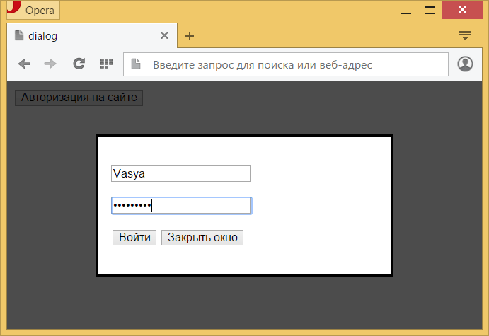

# ::backdrop

Псевдоэлемент **`::backdrop`** отображается ниже самого верхнего элемента в стеке по оси Z, но выше всех остальных элементов на странице, если они имеются. Обычно применяется для затемнения страницы, чтобы акцентировать внимание на фотографии или диалоговом окне, которые выводятся поверх такого затемнения.

В настоящее время работает только с модальными окнами, созданными с помощью элемента [`<dialog>`](../html/dialog.md).

## Синтаксис

```css
/* Подложка показывается только тогда, когда диалоговое окно открыто с помощью метода dialog.showModal() */
dialog::backdrop {
  background: rgba(255, 0, 0, 0.25);
}
```

## Спецификация

- [Fullscreen API](https://fullscreen.spec.whatwg.org/#::backdrop-pseudo-element)

## Пример 1

```html
<!DOCTYPE html>
<html>
  <head>
    <meta charset="utf-8" />
    <title>::backdrop</title>
    <style>
      dialog {
        width: 300px;
      }
      dialog::backdrop {
        background: rgba(0, 0, 0, 0.7);
      }
    </style>
  </head>
  <body>
    <button id="openDialog">Вход на сайт</button>
    <dialog>
      <form id="authentication" action="handler.php">
        <p><input name="login" required autofocus placeholder="Логин" /></p>
        <p>
          <input type="password" name="pass" required placeholder="Пароль" />
        </p>
        <p>
          <button type="submit">Войти</button>
          <button id="closeDialog">Закрыть окно</button>
        </p>
      </form>
    </dialog>
    <script>
      var dialog = document.querySelector('dialog')
      document.querySelector('#openDialog').onclick = function() {
        dialog.showModal()
      }
      document.querySelector('#closeDialog').onclick = function() {
        dialog.close()
      }
    </script>
  </body>
</html>
```

Результат:



## См. также

- [`:fullscreen`](:fullscreen.md)
- [`<dialog>`](../html/dialog.md)

## Ссылки

- [`::backdrop`](https://developer.mozilla.org/ru/docs/Web/CSS/::backdrop) на MDN
