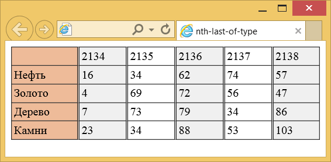

# :nth-last-of-type()

Псевдокласс **`:nth-last-of-type`** используется для добавления стиля к элементам указанного типа на основе нумерации в дереве элементов. В отличие от псевдокласса [`:nth-of-type`](<:nth-of-type().md>) отсчёт ведётся не от первого элемента, а от последнего.

## Синтаксис

```css
/* Выбирает каждый четвёртый элемент <p>
   среди любой группы соседних элементов,
   отсчёт начинается с последнего элемента */
p:nth-last-of-type(4n) {
  color: lime;
}
```

## Значения

`odd`
: Все нечётные номера элементов, начиная с конца.

`even`
: Все чётные номера элементов, начиная с конца.

`<число>`
: Порядковый номер дочернего элемента относительно своего родителя. Нумерация начинается с `1`, это соответствует последнему элементу в списке.

`<выражение>`
: Задаётся в виде `an±b`, где `a` и `b` целые числа, а `n` — счётчик, который автоматически принимает значение `0`, `1`, `2`,…

Если `a` равно нулю, то оно не пишется и запись сокращается до `b`. Если `b` равно нулю, то оно также не указывается и выражение записывается в форме `an`. `a` и `b` могут быть отрицательными числами, в этом случае знак плюс меняется на минус, например: `5n-1`.

За счёт использования отрицательных значений `a` и `b` некоторые результаты могут также получиться отрицательными или равными нулю. Однако на элементы оказывают влияние только положительные значения из-за того, что нумерация элементов начинается с `1`.

В табл. 1 приведены некоторые возможные выражения и ключевые слова, а также указано, какие номера элементов будут задействованы. Отсчёт ведётся от последнего элемента.

Табл. 1. Результат для различных значений псевдокласса

| Значение | Номера элементов   | Описание                                                            |
| -------- | ------------------ | ------------------------------------------------------------------- |
| `1`      | 1                  | Последний элемент, является синонимом псевдокласса `:last-of-type`. |
| `5`      | 5                  | Пятый элемент с конца.                                              |
| `2n`     | 2, 4, 6, 8, 10,…   | Все чётные элементы, начиная с конца; аналог значения `even`.       |
| `2n+1`   | 1, 3, 5, 7, 9,…    | Все нечётные элементы, начиная с конца; аналог значения `odd`.      |
| `3n`     | 3, 6, 9, 12,…      | Каждый третий элемент, начиная с конца.                             |
| `3n+2`   | 2, 5, 8, 11, 14,…  | Каждый третий элемент, начиная с предпоследнего.                    |
| `n+4`    | 4, 5, 6, 7, 8,…    | Все элементы, кроме последних трёх.                                 |
| `-n+3`   | 3, 2, 1            | Последние три элемента.                                             |
| `5n-2`   | 3, 8, 13, 18, 23,… | —                                                                   |
| `even`   | 2, 4, 6, 8, 10,…   | Все чётные элементы, начиная с конца.                               |
| `odd`    | 1, 3, 5, 7, 9,…    | Все нечётные элементы, начиная с конца.                             |

## Спецификации

- [Selectors Level 4](https://drafts.csswg.org/selectors-4/#nth-last-of-type-pseudo)
- [Selectors Level 3](https://drafts.csswg.org/selectors-3/#nth-last-of-type-pseudo)

## Примеры

### Пример 1

```html tab="HTML"
<div>
  <span>Это span.</span>
  <span>Это другой span.</span>
  <em>Это текст будет подчёркнут.</em>
  <span>Круто, этот span лаймовый!!!</span>
  <strike>Это вообще не span.</strike>
  <span>Это ещё один последний span.</span>
</div>
```

```css tab="CSS"
span:nth-last-of-type(2) {
  background-color: lime;
}
```

Результат:


### Пример 2

```html
<!DOCTYPE html>
<html>
  <head>
    <meta charset="utf-8" />
    <title>nth-last-of-type</title>
    <style>
      table {
        width: 100%; /* Ширина таблицы */
        border-collapse: collapse; /* Убираем двойные границы */
        border-spacing: 0; /* Расстояние между ячейками */
      }
      td {
        border: 1px solid #333; /* Параметры рамки */
        padding: 3px; /* Поля в ячейках */
      }
      td:not(:first-of-type) {
        border-left: 3px double #333; /* Граница слева */
      }
      td:first-of-type {
        background: #eb9; /* Цвет фона */
      }
      td:nth-last-of-type(2n + 1) {
        background: #f0f0f0; /* Цвет фона */
      }
    </style>
  </head>
  <body>
    <table>
      <tr>
        <td>&nbsp;</td>
        <td>2134</td>
        <td>2135</td>
        <td>2136</td>
        <td>2137</td>
        <td>2138</td>
      </tr>
      <tr>
        <td>Нефть</td>
        <td>16</td>
        <td>34</td>
        <td>62</td>
        <td>74</td>
        <td>57</td>
      </tr>
      <tr>
        <td>Золото</td>
        <td>4</td>
        <td>69</td>
        <td>72</td>
        <td>56</td>
        <td>47</td>
      </tr>
      <tr>
        <td>Дерево</td>
        <td>7</td>
        <td>73</td>
        <td>79</td>
        <td>34</td>
        <td>86</td>
      </tr>
      <tr>
        <td>Камни</td>
        <td>23</td>
        <td>34</td>
        <td>88</td>
        <td>53</td>
        <td>103</td>
      </tr>
    </table>
  </body>
</html>
```

В данном примере псевдокласс `:nth-last-of-type` используется для выделения цветом всех нечётных колонок, начиная с последней.

Результат:



## См. также

- [:nth-last-child](<:nth-last-child().md>)
- [:nth-of-type](<:nth-of-type().md>)

## Ссылки

- [:nth-last-of-type()](https://developer.mozilla.org/ru/docs/Web/CSS/:nth-last-of-type) на MDN
