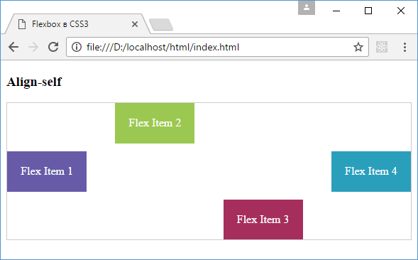

# Выравнивание элементов. align-items и align-self

## Свойство align-items

Свойство [`align-items`](../align-items.md) также выравнивает элементы, но уже по поперечной оси (cross axis) (при расположении в виде строки по вертикали, при расположении в виде столбца - по горизонтали). Это свойство может принимать следующие значения:

- `stretch`: значение по умолчанию, при котором flex-элементы растягиваются по всей высоте (при расположении в строку) или по всей ширине (при расположении в столбик) flex-контейнера
- `flex-start`: элементы выравниваются по верхнему краю (при расположении в строку) или по левому краю (при расположении в столбик) flex-контейнера
- `flex-end`: элементы выравниваются по нижнему краю (при расположении в строку) или по правому краю (при расположении в столбик) flex-контейнера
- `center`: элементы выравниваются по центру flex-контейнера
- `baseline`: элементы выравниваются в соответствии со своей базовой линией

Выравнивание при расположении в строку:

```html
<!DOCTYPE html>
<html>
  <head>
    <meta charset="utf-8" />
    <title>Flexbox в CSS3</title>
    <style>
      .flex-container {
        display: flex;
        border: 1px #ccc solid;
        height: 5em;
      }
      .flex-start {
        align-items: flex-start;
      }
      .flex-end {
        align-items: flex-end;
      }
      .center {
        align-items: center;
      }
      .baseline {
        align-items: baseline;
      }
      .flex-item {
        text-align: center;
        font-size: 1em;
        padding: 1.2em;
        color: white;
      }
      .largest-item {
        padding-top: 2em;
      }
      .color1 {
        background-color: #675ba7;
      }
      .color2 {
        background-color: #9bc850;
      }
      .color3 {
        background-color: #a62e5c;
      }
      .color4 {
        background-color: #2a9fbc;
      }
    </style>
  </head>
  <body>
    <h3>Flex-start</h3>
    <div class="flex-container flex-start">
      <div class="flex-item color1">Flex Item 1</div>
      <div class="flex-item color2">Flex Item 2</div>
      <div class="flex-item color3">Flex Item 3</div>
      <div class="flex-item color4">Flex Item 4</div>
    </div>
    <h3>Flex-end</h3>
    <div class="flex-container flex-end">
      <div class="flex-item color1">Flex Item 1</div>
      <div class="flex-item color2">Flex Item 2</div>
      <div class="flex-item color3">Flex Item 3</div>
      <div class="flex-item color4">Flex Item 4</div>
    </div>
    <h3>Center</h3>
    <div class="flex-container center">
      <div class="flex-item color1">Flex Item 1</div>
      <div class="flex-item color2">Flex Item 2</div>
      <div class="flex-item color3">Flex Item 3</div>
      <div class="flex-item color4">Flex Item 4</div>
    </div>
    <h3>Baseline</h3>
    <div class="flex-container baseline">
      <div class="flex-item color1">Flex Item 1</div>
      <div class="flex-item color2 largest-item">Flex Item 2</div>
      <div class="flex-item color3">Flex Item 3</div>
      <div class="flex-item color4">Flex Item 4</div>
    </div>
  </body>
</html>
```


Аналогично свойство работает при расположении в столбик. Например, изменим стили flex-контейнера следующим образом:

```css
.flex-container {
  display: flex;
  border: 1px #ccc solid;
  flex-direction: column;
  width: 12em;
}
```


## Свойство align-self

Свойство [`align-self`](../align-self.md) позволяет переопределить значение свойства `align-items` для одного элемента. Оно может принимать все те же значения плюс значение `auto`:

- `auto`: значение по умолчанию, при котором элемент получает значение от свойства `align-items`, которое определено в flex-контейнере. Если в контейнере такой стиль не определен, то применяется значение `stretch`.
- `stretch`
- `flex-start`
- `flex-end`
- `center`
- `baseline`

```html
<!DOCTYPE html>
<html>
  <head>
    <meta charset="utf-8" />
    <title>Flexbox в CSS3</title>
    <style>
      .flex-container {
        display: flex;
        border: 1px #ccc solid;
        justify-content: space-between;
        align-items: stretch;
        height: 12em;
      }
      .flex-item {
        text-align: center;
        font-size: 1em;
        padding: 1.2em;
        color: white;
      }
      .item1 {
        background-color: #675ba7;
        align-self: center;
      }
      .item2 {
        background-color: #9bc850;
        align-self: flex-start;
      }
      .item3 {
        background-color: #a62e5c;
        align-self: flex-end;
      }
      .item4 {
        background-color: #2a9fbc;
        align-self: center;
      }
    </style>
  </head>
  <body>
    <h3>Align-self</h3>
    <div class="flex-container">
      <div class="flex-item item1">Flex Item 1</div>
      <div class="flex-item item2">Flex Item 2</div>
      <div class="flex-item item3">Flex Item 3</div>
      <div class="flex-item item4">Flex Item 4</div>
    </div>
  </body>
</html>
```

Здесь для flex-контейнера задано растяжение по высоте с помощью значения `align-items: stretch;`. Однако каждый из элементов переопределяет это поведение:



## См. также

- [align-items](../align-items.md)
- [align-self](../align-self.md)
