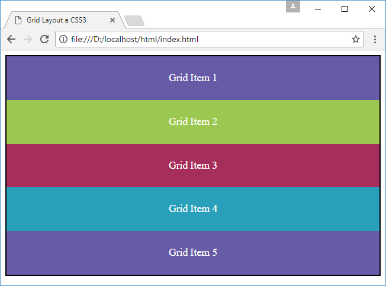
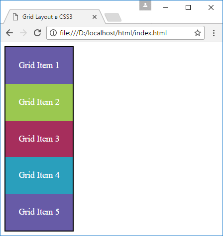

# Что такое Grid Layout. Grid Container

Grid Layout представляет специальный модуль CSS3, который позволяет позиционировать элементы в виде сетки или таблицы. Как и Flexbox, Grid Layout представляет гибкий подход к компоновке элементов, только если flexbox размещает вложенные элементы в одном направлении - по горизонтали в виде столбиков или по вертикали в виде строк, то Grid позиционирует элементы сразу в двух направлениях - в виде строк и столбцов, образуя тем самым таблицу.

Полностью спецификацию модуля Grid Layout можно посмотреть на странице [www.w3.org/TR/css-grid-1/](https://metanit.com/web/html5/www.w3.org/TR/css-grid-1/).

## Поддержка браузерами

При использовании Grid Layout следует учитывать, что только относительно недавно производители браузеров стали внедрять поддержку этого модуля в свои браузеры. Ниже приводится для браузеров список версий, начиная с которых была внедрена полноценная поддержка Grid Layout:

- Google Chrome - с версии 57
- Mozilla Firefox - с версии 52
- Opera - с версии 44
- Safari - с версии 10.1
- iOS Safari - с версии 10.3

Как можно заметить, большинство этих версий браузеров вышли в начале 2017 года. То есть на более старые версии этих браузеров рассчитывать не приходится.

Кроме того, IE (начиная с версии 10) и Microsoft Edge имеет лишь частичную поддержку модуля. А Android Browser, Opera Mini, UC Browser вовсе ее не имеют.

## Создание grid-контейнера

Основой для определения компоновки Grid Layout является grid container, внутри которого размещаются элементы. Для создания grid-контейнера необходимо присвоить его стилевому свойству [`display`](../display.md) одно из двух значений: `grid` или `inline-grid`.

Создадим простейшую веб-страницу, которая применяет Grid Layout:

```html
<!DOCTYPE html>
<html>
  <head>
    <meta charset="utf-8" />
    <meta name="viewport" content="width=device-width" />
    <title>Grid Layout в CSS3</title>
    <style>
      .grid-container {
        border: solid 2px #000;
        display: grid;
      }
      .grid-item {
        text-align: center;
        font-size: 1.1em;
        padding: 1.5em;
        color: white;
      }

      .color1 {
        background-color: #675ba7;
      }
      .color2 {
        background-color: #9bc850;
      }
      .color3 {
        background-color: #a62e5c;
      }
      .color4 {
        background-color: #2a9fbc;
      }
    </style>
  </head>
  <body>
    <div class="grid-container">
      <div class="grid-item color1">Grid Item 1</div>
      <div class="grid-item color2">Grid Item 2</div>
      <div class="grid-item color3">Grid Item 3</div>
      <div class="grid-item color4">Grid Item 4</div>
      <div class="grid-item color1">Grid Item 5</div>
    </div>
  </body>
</html>
```

Для контейнера grid-container установлено свойство `display: grid`. В нем располагается пять grid-элементов.



Если значение `grid` определяет контейнер как блочный элемент, то значение `inline-grid` определяет элемент как строчный (`inline`):

```html
<!DOCTYPE html>
<html>
  <head>
    <meta charset="utf-8" />
    <meta name="viewport" content="width=device-width" />
    <title>Grid Layout в CSS3</title>
    <style>
      .grid-container {
        border: solid 2px #000;
        display: inline-grid;
      }

      .grid-item {
        box-sizing: border-box;
        text-align: center;
        font-size: 1.1em;
        padding: 1.5em;
        color: white;
      }

      .color1 {
        background-color: #675ba7;
      }
      .color2 {
        background-color: #9bc850;
      }
      .color3 {
        background-color: #a62e5c;
      }
      .color4 {
        background-color: #2a9fbc;
      }
    </style>
  </head>
  <body>
    <div class="grid-container">
      <div class="grid-item color1">Grid Item 1</div>
      <div class="grid-item color2">Grid Item 2</div>
      <div class="grid-item color3">Grid Item 3</div>
      <div class="grid-item color4">Grid Item 4</div>
      <div class="grid-item color1">Grid Item 5</div>
    </div>
  </body>
</html>
```

В этом случае весь грид занимает только то пространство, которое необходимо для размещения его элементов.


