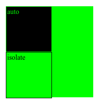

# isolation

Свойство **`isolation`** определяет, должен ли элемент создать новый контекст стека.

Это особенно полезно в сочетании с [`background-blend-mode`](background-blend-mode.md), которые только смешивают фон в заданном контексте стекирования: он позволяет изолировать группы элементов от их более глубокого фона и смешать их фоновый цвет вместе.

## Синтаксис

```css
/* Keyword values */
isolation: auto;
isolation: isolate;

/* Global values */
isolation: inherit;
isolation: initial;
isolation: unset;
```

## Значения

`auto`
: указывает, что новый контекст стека должен быть создан только в том случае, если это требует свойство, применяемое к элементу.

`isolate`
: указывает, что должен быть создан новый контекст стека.

Значение по-умолчанию:

```css
isolation: auto;
```

Применяется ко всем элементам

## Спецификации

- [Compositing and Blending Level 1](https://drafts.fxtf.org/compositing-1/#isolation)

## Описание и примеры

```html tab="HTML"
<div id="b" class="a">
  <div id="d">
    <div class="a c">auto</div>
  </div>
  <div id="e">
    <div class="a c">isolate</div>
  </div>
</div>
```

```css tab="CSS"
.a {
  background-color: rgb(0, 255, 0);
}
#b {
  width: 200px;
  height: 210px;
}
.c {
  width: 100px;
  height: 100px;
  border: 1px solid black;
  padding: 2px;
  mix-blend-mode: difference;
}
#d {
  isolation: auto;
}
#e {
  isolation: isolate;
}
```

Результат


