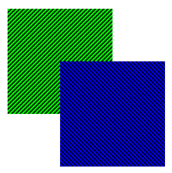
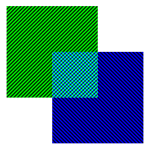
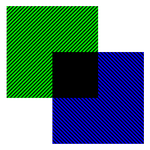
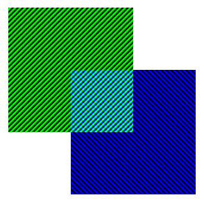
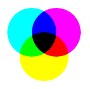

# mix-blend-mode

Свойство **`mix-blend-mode`** опреляет режим смешивания цветов выбранного элемента с низлежащими слоями.

## Синтаксис

```css
/* Ключевые слова */
mix-blend-mode: normal;
mix-blend-mode: multiply;
mix-blend-mode: screen;
mix-blend-mode: overlay;
mix-blend-mode: darken;
mix-blend-mode: lighten;
mix-blend-mode: color-dodge;
mix-blend-mode: color-burn;
mix-blend-mode: hard-light;
mix-blend-mode: soft-light;
mix-blend-mode: difference;
mix-blend-mode: exclusion;
mix-blend-mode: hue;
mix-blend-mode: saturation;
mix-blend-mode: color;
mix-blend-mode: luminosity;

/* Глобальные значения */
mix-blend-mode: initial;
mix-blend-mode: inherit;
mix-blend-mode: unset;
```

Значение по умолчанию: `normal`

## Значения

- `blend-mode` -- Собственно режим смешивания. Может быть задано несколько значений через запятую.

## Спецификация

- [Compositing and Blending Level 1](https://drafts.fxtf.org/compositing-1/#mix-blend-mode)

## Описание и примеры

### normal



Конечный цвет -- это верхний цвет, независимо от того, что представляет собой нижний цвет. Эффект подобен двум непрозрачным кускам бумаги, перекрывающимся друг над другом.

### multiply


Конечный цвет -- результат умножения верхнего и нижнего цветов. Черный слой приводит к черному окончательному слою, а белый слой не приводит к изменению. Эффект подобен двум изображениям, нанесенным на прозрачную пленку.

### screen



Конечный цвет является результатом инверсии цветов, их умножения и инвертирования этого значения. Черный слой не приводит к изменению, а белый слой приводит к белому окончательному слою. Эффект подобен двум изображениям, сияющим на экране проекции.

### overlay


Конечный цвет -- результат `multiply`, если нижний цвет темнее или `screen`, если нижний цвет светлее. Этот режим смешивания эквивалентен `hard-light`, но со слоем обмена.

### darken



Конечный цвет состоит из самых темных значений каждого цветового канала.

### lighten


Конечный цвет состоит из самых светлых значений каждого цветового канала.

### color-dodge


Конечный цвет -- результат деления нижнего цвета на обратный верхний цвет. Черный передний план не приводит к изменению. Передний план с обратным цветом фона приводит к полностью освещенному цвету.

Этот режим смешивания похож на `screen`, но передняя часть должна быть только такой же cdtnkjq, как обратная сторона фона, чтобы создать полностью освещенный цвет.

### color-burn


Конечный цвет является результатом инвертирования нижнего цвета, деления значения на верхний цвет и инвертирования этого значения. Белый передний план не дает никаких изменений. Передний план с обратным цветом фона приводит к черному окончательному изображению.

Этот режим смешивания аналогичен `multiply`, но переднего плана нужно только быть темным, как обратное к фону, чтобы сделать окончательное изображение черным.

### hard-light


Конечный цвет -- результат `multiply`, если верхний цвет темнее или `screen`, если верхний цвет светлее. Этот режим смешивания эквивалентен `overlay`, но со слоем обмена. Эффект подобен сиянию сурового прожектора на заднем плане.

### soft-light


Конечный цвет похож на `hard-light`, но мягче. Этот режим смешивания ведет себя аналогично `hard-light`. Эффект подобен сиянию рассеянного прожектора на заднем плане.

### difference


Конечный цвет -- результат вычитания более темного из двух цветов из более светлого. Черный слой не действует, а белый слой инвертирует цвет другого слоя.

### exclusion



Конечный цвет похож на `difference`, но с меньшим контрастом. Как и `difference`, черный слой не действует, а белый слой инвертирует цвет другого слоя.

### hue


Конечный цвет имеет оттенок верхнего цвета, используя насыщенность и светимость нижнего цвета.

### saturation


Конечный цвет имеет насыщенность верхнего цвета, используя оттенок и светимость нижнего цвета. Чистый серый фон, без насыщения, не будет иметь никакого эффекта.

### color


Конечный цвет имеет оттенок и насыщенность верхнего цвета, при этом используется яркость нижнего цвета. Эффект сохраняет уровни серого и может использоваться для раскрашивания переднего плана.

### luminosity


Конечный цвет имеет яркость верхнего цвета, используя оттенок и насыщенность нижнего цвета. Этот режим смешивания эквивалентен `color`, но при этом слои меняются местами.

### Пример

HTML:

```html
<svg>
  <circle cx="40" cy="40" r="40" fill="cyan" />
  <circle cx="80" cy="40" r="40" fill="magenta" />
  <circle cx="60" cy="80" r="40" fill="yellow" />
</svg>
```

CSS:

```css
circle {
  mix-blend-mode: multiply;
}
```

Результат:


