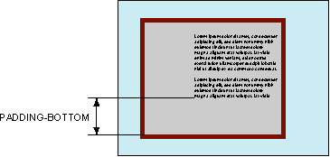

# padding-bottom

Свойство **`padding-bottom`** устанавливает значение поля от нижнего края содержимого элемента.

Полем называется расстояние от внутреннего края рамки элемента до воображаемого прямоугольника, ограничивающего его содержимое (рис. 1).



## Синтаксис

```css
/* <length> values */
padding-bottom: 0.5em;
padding-bottom: 0;
padding-bottom: 2cm;

/* <percentage> value */
padding-bottom: 10%;

/* Global values */
padding-bottom: inherit;
padding-bottom: initial;
padding-bottom: unset;
```

## Значения

Величину нижнего поля можно указывать в пикселях (px), процентах (%) или других допустимых для CSS единицах. При указании поля в процентах, значение считается от ширины родителя элемента.

Значение по-умолчанию:

```css
padding-bottom: 0;
```

Применяется к: Ко всем элементам

## Спецификации

- [CSS Basic Box Model](http://dev.w3.org/csswg/css3-box/#the-padding)
- [CSS Level 2 (Revision 1)](http://www.w3.org/TR/CSS2/box.html#padding-properties)
- [CSS Level 1](http://www.w3.org/TR/CSS1/#padding-bottom)

## Описание и примеры

```html
<!DOCTYPE html>
<html>
  <head>
    <meta charset="utf-8" />
    <title>padding-bottom</title>
    <style>
      .layer {
        background: #fc3; /* Цвет фона */
        border: 2px solid #000; /* Параметры рамки */
        padding-bottom: 40px; /* Поле снизу от текста */
        padding-top: 40px; /* Поле сверху от текста */
        text-align: center; /* Выравнивание по центру */
      }
    </style>
  </head>
  <body>
    <div class="layer">
      Фотосинтетический бромид серебра: предпосылки и развитие
    </div>
  </body>
</html>
```
