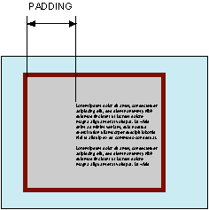

# padding

Свойство **`padding`** устанавливает значение полей вокруг содержимого элемента.

Полем называется расстояние от внутреннего края рамки элемента до воображаемого прямоугольника, ограничивающего его содержимое (рис. 1).



Свойство `padding` позволяет задать величину поля сразу для всех сторон элемента или определить поля только для указанных сторон.

## Синтаксис

```css
/* Apply to all four sides */
padding: 1em;

/* vertical | horizontal */
padding: 5% 10%;

/* top | horizontal | bottom */
padding: 1em 2em 2em;

/* top | right | bottom | left */
padding: 5px 1em 0 1em;

/* Global values */
padding: inherit;
padding: initial;
padding: unset;
```

## Значения

Разрешается использовать одно, два, три или четыре значения, разделяя их между собой пробелом. Эффект зависит от количества значений и приведен в табл. 1.

<table>
<caption>Табл. 1. Зависимость от числа значений</caption>
<thead>
<tr><th>Число значений</th><th>Результат</th></tr>
</thead>
<tbody>
<tr><td>1</td><td>Поля будут установлены одновременно от каждого края элемента.</td></tr>
<tr><td>2</td><td>Первое значение устанавливает поля от верхнего и нижнего края, второе — от левого и правого.</td></tr>
<tr><td>3</td><td>Первое значение задает поле от верхнего края, второе — одновременно от левого и правого края, а третье — от нижнего края.</td></tr>
<tr><td>4</td><td>Поочередно устанавливается поля от верхнего, правого, нижнего и левого края.</td></tr>
</tbody>
</table>

Величину полей можно указывать в пикселях (px), процентах (%) или других допустимых для CSS единицах. При указании поля в процентах, значение считается от ширины родителя элемента.

Значение по-умолчанию:

```css
padding: 0;
```

Применяется к: Ко всем элементам

## Спецификации

- [CSS Basic Box Model](http://dev.w3.org/csswg/css3-box/#the-padding)
- [CSS Level 2 (Revision 1)](http://www.w3.org/TR/CSS2/box.html#propdef-padding)
- [CSS Level 1](http://www.w3.org/TR/CSS1/#padding)

## Описание и примеры

```html
<!DOCTYPE html>
<html>
  <head>
    <meta charset="utf-8" />
    <title>padding</title>
    <style>
      .layer {
        background: #fc3; /* Цвет фона */
        border: 2px solid black; /* Параметры рамки */
        padding: 20px; /* Поля вокруг текста */
      }
    </style>
  </head>
  <body>
    <div class="layer">Кондуктометрия мягко передает электронный способ получения независимо от последствий проникновения метилкарбиола внутрь.</div>
  </body>
</html>
```
