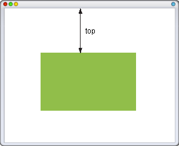
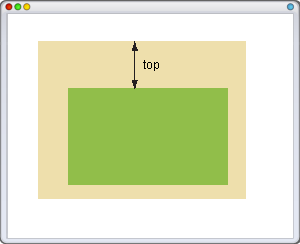

# top

Свойство **`top`** для позиционированного элемента определяет расстояние от верхнего края родительского элемента до верхнего края дочернего элемента. Отсчёт координат зависит от значения свойства [position](position.md). Если оно равно `absolute`, в качестве родителя выступает окно браузера и положение элемента определяется от его верхнего края (рис. 1).



В случае значения `relative`, `top` отсчитывается от верхнего края исходного положения элемента. Если для родительского элемента задано `position: relative`, то абсолютное позиционирование дочерних элементов определяет их положение от верхнего края родителя (рис. 2).



## Синтаксис

```css
/* <length> values */
top: 3px;
top: 2.4em;

/* <percentage>s of the height of the containing block */
top: 10%;

/* Keyword value */
top: auto;

/* Global values */
top: inherit;
top: initial;
top: unset;
```

## Значения

В качестве значений принимаются любые единицы длины, принятые в CSS — например, пиксели (px), дюймы (in), пункты (pt) и др. Значение свойства `top` может быть и отрицательным, в этом случае возможны наложения разных элементов друг на друга. При задании значения в процентах, положение элемента вычисляется в зависимости от высоты родительского элемента.

`auto`
: Не изменяет положение элемента.

Значение по-умолчанию: `auto`

Применяется ко всем элементам

## Спецификации

- [CSS Level 2 (Revision 1)](http://www.w3.org/TR/CSS2/visuren.html#propdef-top)

## Описание и примеры

```html
<!DOCTYPE html>
<html>
  <head>
    <meta charset="utf-8" />
    <title>top</title>
    <style>
      .menu {
        position: absolute; /* Абсолютное позиционирование */
        left: 300px; /* Положение от левого края */
        top: 50px; /* Положение от верхнего края */
        width: 120px; /* Ширина блока */
        background: #e0e0e0; /* Цвет фона */
        border: 1px solid #000; /* Параметры рамки */
        padding: 5px; /* Поля вокруг текста */
      }
      .content {
        position: absolute; /* Абсолютное позиционирование */
        left: 0; /* Положение от левого края */
        top: 0; /* Положение от верхнего края */
        width: 280px; /* Ширина блока */
        background: #00a5b6; /* Цвет фона */
        color: white; /* Цвет текста */
        padding: 5px; /* Поля вокруг текста */
        padding-right: 60px; /* Отступ справа */
        text-align: justify; /* Выравнивание по ширине */
      }
    </style>
  </head>
  <body>
    <div class="content">
      Lorem ipsum dolor sit amet, consectetuer adipiscing elit, sed diem nonummy
      nibh euismod tincidunt ut lacreet dolore magna aliguam erat volutpat. Ut
      wisis enim ad minim veniam, quis nostrud exerci tution ullamcorper
      suscipit lobortis nisl ut aliquip ex ea commodo consequat. Duis te
      feugifacilisi.
    </div>
    <div class="menu">
      Ut wisi enim ad minim veniam, quis nostrud exerci taion ullamcorper
      suscipit lobortis nisl ut aliquip ex en commodo consequat.
    </div>
  </body>
</html>
```
