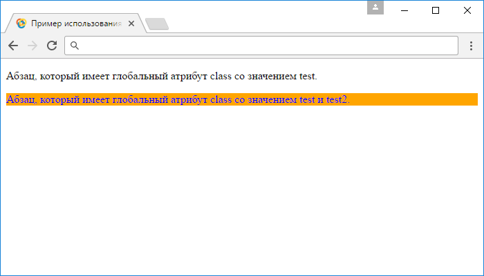

# Селектор class

Селектор `class` выбирает элементы, глобальный атрибут `class` которых, имеет указанное значение.

Для поиска элемента с указанным классом, библиотека jQuery использует функцию JavaScript `document.getElementByClassName()`, вследствие чего, поиск элементов происходит быстро.

Обратите внимание на следующие общие правила, которые необходимо соблюдать при работе с селекторами класса:

- все названия селекторов класса должны начинаться с точки (благодаря ей браузеры находят эти селекторы в таблице стилей). Точка требуется только в названии селектора таблицы стилей (в значении глобального HTML атрибута `class` она не ставится).
- используйте только буквы алфавита (`A-Z`, `a-z`), числа, дефисы, знаки подчеркивания.
- название после точки всегда должно начинаться с символа (неправильно: `.50cent`, `.-vottakvot`).
- учитывайте регистр при наименовании стилевых классов, т. к. они к этому чувствительны (`.vottakvot` и `.VotTakVot` разные классы).

## Синтаксис

```js
$('.class')
```

Добавлен в версии jQuery 1.0

## Пример

```html
<!DOCTYPE html>
<html>
  <head>
    <title>Использование jQuery селектора class</title>
    <script src="https://ajax.googleapis.com/ajax/libs/jquery/3.1.0/jquery.min.js"></script>
    <script>
      $(document).ready(function() {
        $('.test').css({
          // выбираем элементы с указанным классом
          color: 'red', // задаем цвет текста
          'background-color': 'orange'
        }) // задаем цвет заднего фона
      })
    </script>
  </head>
  <body>
    <p class="test">
      Абзац, который имеет глобальный атрибут class со значением test.
    </p>
  </body>
</html>
```

Результат нашего примера:


Пример использования jQuery селектора class.

## Пример 2

Рассмотрим пример в котором используем селектор, который найдет элемент, который имеет одновременно два класса, которые мы укажем.

```html
<!DOCTYPE html>
<html>
  <head>
    <title>Использование jQuery селектора class</title>
    <script src="https://ajax.googleapis.com/ajax/libs/jquery/3.1.0/jquery.min.js"></script>
    <script>
      $(document).ready(function() {
        $('.test.test2').css({
          // выбираем элементы у которых встречаются указанные  классы
          color: 'red', // устанавливаем цвет текста
          'background-color': 'orange'
        }) // задаем цвет заднего фона
      })
    </script>
  </head>
  <body>
    <p class="test">
      Абзац, который имеет глобальный атрибут class со значением test.
    </p>
    <p class="test test2">
      Абзац, который имеет глобальный атрибут class со значением test и test2.
    </p>
  </body>
</html>
```

Результат нашего примера:



Пример поиска элемента с несколькими классами.
