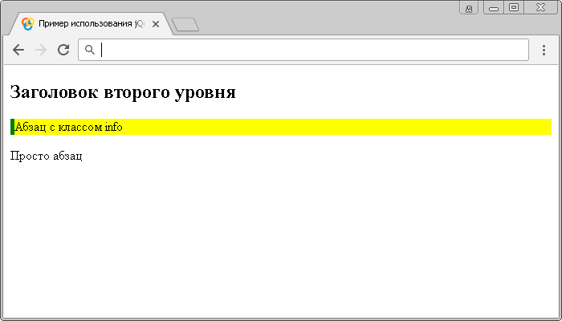

# Селектор смежных элементов

Селектор смежных элементов позволяет выбрать все первые указанные элементы внутри родительского элемента, которые следуют сразу же за смежным для него элементом.

Синтаксис

```js
$('selector + selector')
/* в качестве следующего элемента может выступать любой селектор */
```

Добавлен в версии jQuery 1.0

## Пример

```html
<!DOCTYPE html>
<html>
  <head>
    <title>Использование jQuery селектора смежных элементов</title>
    <script src="https://ajax.googleapis.com/ajax/libs/jquery/3.1.0/jquery.min.js"></script>
    <script>
      $(document).ready(function() {
        $('h2 + p').css('background-color', 'yellow') // выбирает все элементы <p> внутри родительского элемента, которые следуют сразу же за элементами <h2>
        $('.main + .info').css('border-left', '5px solid green') // выбирает все элементы с классом .info внутри родительского элемента, которые следуют сразу же за элементами с классом .main
      })
    </script>
  </head>
  <body>
    <div>
      <h2 class="main">Заголовок второго уровня</h2>
      <p class="info">Абзац с классом info</p>
      <p>Просто абзац</p>
    </div>
  </body>
</html>
```

В этом примере с использованием селектора смежных элементов jQuery, мы выбрали все элементы `<p>` внутри родительского элемента, которые следуют сразу же за элементами `<h2>` и все элементы с классом `.info` внутри родительского элемента, которые следуют сразу же за элементами с классом `.main` (выбрали те же элементы, только в качестве селекторов указали не селекторы типа, а селекторы класса). В первом случае мы установили цвет заднего фона, а во втором сплошную границу зеленого цвета размером 5 пикселей с левой стороны.

Результат нашего примера:



Пример использования jQuery селектора смежных элементов.
