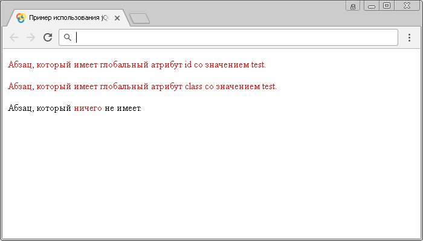

# Групповой селектор

Групповой селектор позволяет выбрать группу селекторов, в которую могут входить как селекторы элемента, селекторы класса, `id` селекторы и так далее. При перечислении любых селекторов необходимо обязательно разделять их запятой.

## Синтаксис

```js
$('selector1, selector2, selectorN')
```

Добавлен в версии jQuery 1.0

## Пример

```html
<!DOCTYPE html>
<html>
  <head>
    <title>Использование jQuery группового селектора</title>
    <script src="https://ajax.googleapis.com/ajax/libs/jquery/3.1.0/jquery.min.js"></script>
    <script>
      $(document).ready(function() {
        $('#test, .test, span').css('color', 'red') // выбирает элементы с идентификатором test, классом test и все элементы <span>
      })
    </script>
  </head>
  <body>
    <p id="test">
      Абзац, который имеет глобальный атрибут id со значением test.
    </p>
    <p class="test">
      Абзац, который имеет глобальный атрибут class со значением test.
    </p>
    <p>Абзац, который <span>ничего</span> не имеет.</p>
  </body>
</html>
```

В этом примере с использованием группового селектора jQuery мы выбрали все элементы с идентификатором `test`, классом `test` и все элементы `<span>`.

Результат нашего примера:



Пример использования jQuery группового селектора.
