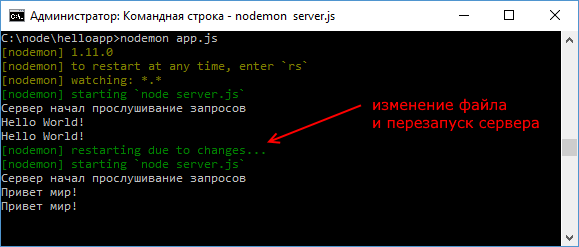

# Nodemon

В процессе разработки может потребоваться необходимость внести изменения в уже запущенный проект. Допустим, у нас в файле `app.js` определен следующий код:

```js
const http = require('http')

let message = 'Hello World!'
http
  .createServer(function(request, response) {
    console.log(message)
    response.end(message)
  })
  .listen(3000, '127.0.0.1', () => {
    console.log('Сервер начал прослушивание запросов')
  })
```

Запустим сервер с помощью команды `node app.js`, и при обращении пользователя по адресу `http://localhost:3000/` браузер пользователя отобразит строку `Hello World!`. Одновременно строка выводится на консоль.


При этом сервер продолжает быть запущенным. И если мы изменим переменную `message` в файле `app.js`, то это никак не повлияет на работу сервера, и он будет продолжать отдавать клиенту строку `Hello World!`.

В этом случае необходимо перезапустить сервер. Однако это не очень удобно, особенно когда необходимо часто делать различные изменения, тестировать выполнение. И в этом случае нам может помочь специальный инструмент `nodemon`.

Установим `nodemon` в проект с помощью следующей команды:

```
npm install nodemon -g
```

Флаг `-g` представляет сокращение от `global` и позволяет установить зависимость `nodemon` глобально для всех проектов на данной локальной машине.

После установки запустим файл `app.js` с помощью следующей команды:

```
nodemon app.js
```

И если вдруг после запуска сервера мы изменим его код, например, поменяем переменную `message` с `Hello World!` на `Привет мир!`, то сервер автоматически будет перезапущен:


