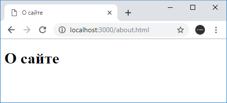

# Отправка файлов

Отправка статических файлов - довольно частая задача в построении и функционировании веб-приложеия. Рассмотрим, как отправлять файлы в приложении на Node.js.

Пусть в каталоге поекта у нас будут три файла:

- `app.js`
- `about.html`
- `index.html`

Наряду с файлом приложения `app.js` определим два html-файла. В файле `index.html` определим следующий код:

```html
<!DOCTYPE html>
<html>
  <head>
    <title>Главная</title>
    <meta charset="utf-8" />
  </head>
  <body>
    <h1>Главная</h1>
  </body>
  <html></html>
</html>
```

Аналогично определим код в файле `about.html`:

```html
<!DOCTYPE html>
<html>
  <head>
    <title>О сайте</title>
    <meta charset="utf-8" />
  </head>
  <body>
    <h1>О сайте</h1>
  </body>
  <html></html>
</html>
```

Наша задача будет заключаться в том, чтобы отправить их содержимое пользователю.

## Первый способ

Для считывания файла может применяться метод `fs.createReadStream()`, который считывает файл в поток, и затем с помощью метода `pipe()` мы можем связать считанные файлы с потоком записи, то есть объектом `response`. Итак, поместим в файл `app.js` следующий код:

```js
const http = require('http')
const fs = require('fs')

http
  .createServer(function(request, response) {
    console.log(`Запрошенный адрес: ${request.url}`)
    // получаем путь после слеша
    const filePath = request.url.substr(1)
    // смотрим, есть ли такой файл
    fs.access(filePath, fs.constants.R_OK, err => {
      // если произошла ошибка - отправляем статусный код 404
      if (err) {
        response.statusCode = 404
        response.end('Resourse not found!')
      } else {
        fs.createReadStream(filePath).pipe(response)
      }
    })
  })
  .listen(3000, function() {
    console.log('Server started at 3000')
  })
```

Вначале мы получаем запрошенный адрес. Допустим, запрошенный адрес будет соответствовать напрямую пути к файлу на сервере. Затем с помощью асинхронной функции `fs.access` проверяем доступность файла для чтения. Первый параметр функции - путь к файлу. Второй параметр - опция, относительно которой проверяется доступ. В данном случае значение `fs.constants.R_OK` говорит о том, что мы проверяем права на чтение из файла. Третий параметр функции - функция обратного вызова, которая получает объект ошибки. Если произошла ошибка (файл не досупен для чтения или вовсе не найден), посылаем статусный код `404`.

Для отправки файла применяется цепочка методов

```js
fs.createReadStream('some.doc').pipe(response)
```

Метод `fs.createReadStream("some.doc")` создает поток для чтения - объект `fs.ReadStream`. Для получения данных из потока вызывается метод `pipe()`, в который передается объект интерфейса `stream.Writable` или поток для записи. А именно таким и является объект `http.ServerResponse`, который реализует этот интерфейс.

Запустим приложение и в браузере обратимся по адресу [http://localhost:3000/index.html](http://localhost:3000/index.html):


Аналогично мы можем обратиться по адресу [http://localhost:3000/about.html](http://localhost:3000/about.html):



В даном случае отправляются файлы html, но подобным образом мы можем отправлять самые разные файлы. Например, определим в проекте папку `public`. И в ней создадим новый файл `styles.css` со следующим содержимым:

```css
body {
  font-family: Verdana;
  color: rgb(48, 48, 92);
}
```

Применим эти стили на странице `index.html`:

```html
<!DOCTYPE html>
<html>
  <head>
    <title>Главная</title>
    <meta charset="utf-8" />
    <link href="public/styles.css" rel="stylesheet" type="text/css" />
  </head>
  <body>
    <h1>Главная</h1>
  </body>
  <html></html>
</html>
```

И затем обратимся к `index.html`:


## Второй способ

Второй способ представляет чтение данных с помощью функции `fs.readFile()` и отправка с помощью метода `response.end()`:

```js
const http = require('http')
const fs = require('fs')

http
  .createServer(function(request, response) {
    console.log(`Запрошенный адрес: ${request.url}`)
    // получаем путь после слеша
    const filePath = request.url.substr(1)
    fs.readFile(filePath, function(error, data) {
      if (error) {
        response.statusCode = 404
        response.end('Resourse not found!')
      } else {
        response.end(data)
      }
    })
  })
  .listen(3000, function() {
    console.log('Server started at 3000')
  })
```
