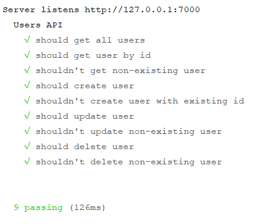

# Тестирование

**Тестирование** Node.js приложений позволяет избегать регрессионных ошибок при добавлении нового функционала или при изменении уже существующего. Поскольку с помощью Node.js создаются именно серверные приложения, в данной статье будет рассмотрено только тестирование API.

Рассмотрим тестирование API на примере, приведенном в статье [REST API](rest-api.md). Только из `app.js` необходимо экспортировать экземпляр созданного сервера.

_app.js_

```js
module.exports = app
```

Экземпляр сервера, созданного с помощью Express, экспортируется для последующего его использования при написании тестов.

Для тестирования необходимо установить модули `mocha`, `chai` и `chai-http`.

```
npm install mocha chai chai-http --save
```

Модуль `mocha` предоставляет асинхронную среду для выполнения тестов и общие конструкции для их создания: `describe`, `it` и т. д. Модули `chai` и `chai-http` являются библиотеками утверждения по отношению к `mocha` и предоставляют дополнительные функции для написания специализированных тестов, например, для проверки API.

Тесты для приведенного выше REST API.

_test.js_

```js
process.env.NODE_ENV = 'test'

const chai = require('chai'),
  chaiHttp = require('chai-http'),
  expect = chai.expect
;(fs = require('fs')), (server = require('./app'))

chai.use(chaiHttp)

describe('Users API', () => {
  before(() => {
    const TEST_DATA = {
      1: { id: 1, login: 'login1', password: 'password1' },
      2: { id: 2, login: 'login2', password: 'password2' }
    }

    fs.writeFileSync('data-test.json', JSON.stringify(TEST_DATA))
  })

  it('should get all users', done => {
    chai
      .request(server)
      .get('/api/users')
      .end((err, res) => {
        expect(err).to.be.null
        expect(res).to.have.status(200)
        expect(res.body).to.haveOwnProperty('data')

        done()
      })
  })

  it('should get user by id', done => {
    chai
      .request(server)
      .get('/api/users')
      .query({ id: 2 })
      .end((err, res) => {
        expect(err).to.be.null
        expect(res).to.have.status(200)
        expect(res.body).to.haveOwnProperty('data')
        expect(res.body.data.id).to.equal(2)

        done()
      })
  })

  it("shouldn't get non-existing user", done => {
    chai
      .request(server)
      .get('/api/users')
      .query({ id: 4 })
      .end((err, res) => {
        expect(err).to.be.null
        expect(res).to.have.status(404)
        expect(res.body).to.haveOwnProperty('message')

        done()
      })
  })

  it('should create user', done => {
    chai
      .request(server)
      .post('/api/users')
      .send({
        user: {
          id: 3,
          login: 'login3',
          password: 'password3'
        }
      })
      .end((err, res) => {
        expect(err).to.be.null
        expect(res).to.have.status(200)
        expect(res.body).to.haveOwnProperty('message')

        done()
      })
  })

  it("shouldn't create user with existing id", done => {
    chai
      .request(server)
      .post('/api/users')
      .send({
        user: {
          id: 3,
          login: 'login3',
          password: 'password3'
        }
      })
      .end((err, res) => {
        expect(err).to.be.null
        expect(res).to.have.status(409)
        expect(res.body).to.haveOwnProperty('message')

        done()
      })
  })

  it('should update user', done => {
    chai
      .request(server)
      .put('/api/users')
      .send({
        user: {
          id: 3,
          login: 'login_3',
          password: 'password_3'
        }
      })
      .end((err, res) => {
        expect(err).to.be.null
        expect(res).to.have.status(200)
        expect(res.body).to.haveOwnProperty('message')

        done()
      })
  })

  it("shouldn't update non-existing user", done => {
    chai
      .request(server)
      .put('/api/users')
      .send({
        user: {
          id: 4,
          login: 'login_4',
          password: 'password_4'
        }
      })
      .end((err, res) => {
        expect(err).to.be.null
        expect(res).to.have.status(404)
        expect(res.body).to.haveOwnProperty('message')

        done()
      })
  })

  it('should delete user', done => {
    chai
      .request(server)
      .delete('/api/users')
      .query({ id: 2 })
      .end((err, res) => {
        expect(err).to.be.null
        expect(res).to.have.status(200)
        expect(res.body).to.haveOwnProperty('message')

        done()
      })
  })

  it("shouldn't delete non-existing user", done => {
    chai
      .request(server)
      .delete('/api/users')
      .query({ id: 4 })
      .end((err, res) => {
        expect(err).to.be.null
        expect(res).to.have.status(404)
        expect(res.body).to.haveOwnProperty('message')

        done()
      })
  })
})
```

Результат в консоли должен быть таким.



!!! note ""

    Здесь переменной `process.env.NODE_ENV` задается тестовое окружение, чтобы тестирование API происходило на файле `data-test.json` и не затронуло реальных данных в `data.json`.

Перед запуском тестов в блоке `before()` в файл записываются исходные для тестов данные.

Запросы `GET`, `POST`, `PUT` и `DELETE` осуществляются с помощью одноименных методов, вызываемых по отношению к объекту, который возвращает метод `request()`. Все эти методы принимают URL маршрута, на который должен быть выполнен запрос.

Для конфигурации запроса используются следующие методы:

- `set` - задает HTTP-заголовки;
- `query` - устанавливает GET-параметры;
- `send` - задает тело запроса (для POST- или PUT-запросов);
- `attach` - позволяет прикреплять к запросу файлы.

Вызов `request()` инициирует запуск сервера и после выполнения запроса автоматически вызывает метод `close()` завершая его работу. Но в процессе тестирования скорее всего придется осуществлять более одного запроса и тогда запуск и остановка сервера для каждого запроса потребует больше вычислительных мощностей и займет больше времени. Чтобы избежать этого, используйте метод `keepOn()`.

```js
let requester = chai.request(app).keepOpen()

Promise.all([requester.get('/api/users'), requester.get('/api/users').query({ id: 2 })])
  .then(responses => {}) //массив ответов
  .then(() => requester.close())
```

Использование `keepOn()` не завершает работу сервера после выполнения запроса(ов), для этого необходимо самостоятельно вызвать метод `close()`.

Для проверки корректности запроса используется функция `expect()` модуля `chai`, которая принимает два параметра: проверяемое значение и сообщение, которое будет выведено при неудачном выполнении теста (необязательный параметр).

Применительно к возвращаемому функцией `expect()` значению используются специальные функции, задающие определенные условия для проверки переданного значения (`equal`, `not`, `empty` и т. д.). С полным списком таких функций можно ознакомиться в [официальной документации](https://www.chaijs.com/api/bdd/).

Конректно для HTTP-запросов модуль `chai-http` предоставляет набор дополнительных функций, вызываемых после `equal`, `not`, `empty` и т. д. и позволяющих проверять специфические для объектов запроса и ответа свойства.

Список функций chai-http:

`header` - проверяет наличие определенного HTTP-заголовка;

```js
expect(res).to.have.header('content-type', 'text/html')
```

`headers` - проверяет наличие HTTP-заголовков в целом;

```js
expect(res).to.have.headers
```

`ip` - проверяет, является ли переданная строка IP-адресом;

```js
expect('127.0.0.1').to.be.an.ip
```

`json`/`text`/`html` - проверяет значение заголовка `Content-type`;

```js
expect(res).to.be.json
expect(res).to.be.text
expect(res).to.be.html
```

`redirect` - проверяет соответствие кода ответа к одному из кодов редиректа;

```js
expect(res).to.redirect
```

`redirectTo` - проверяет, был ли редирект на определенный маршрут;

```js
expect(res).to.redirectTo('http://redirect.com')
```

`cookie` - проверяет наличие и значение cookie-файлов.

```js
expect(req).to.have.cookie('token')
expect(req).to.have.cookie('token', 'abcdefg')
```
