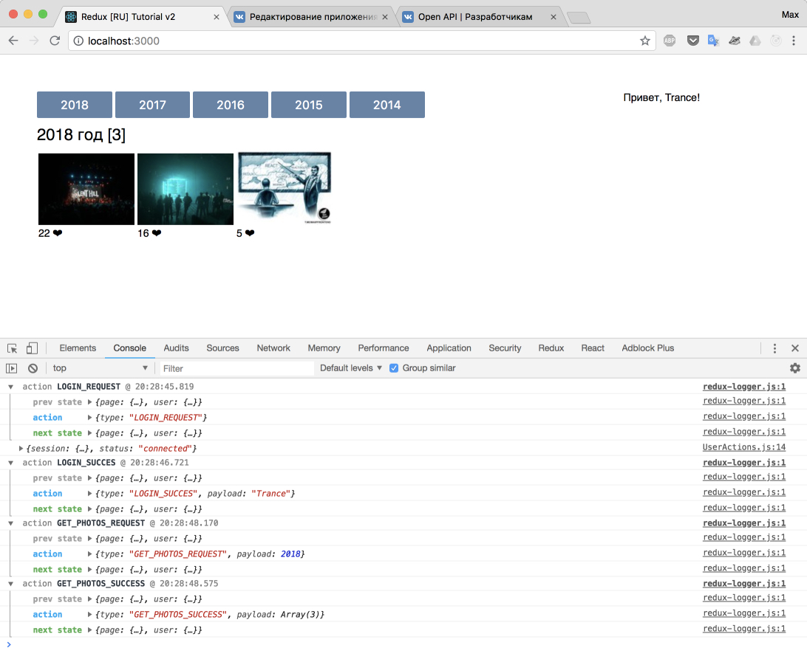
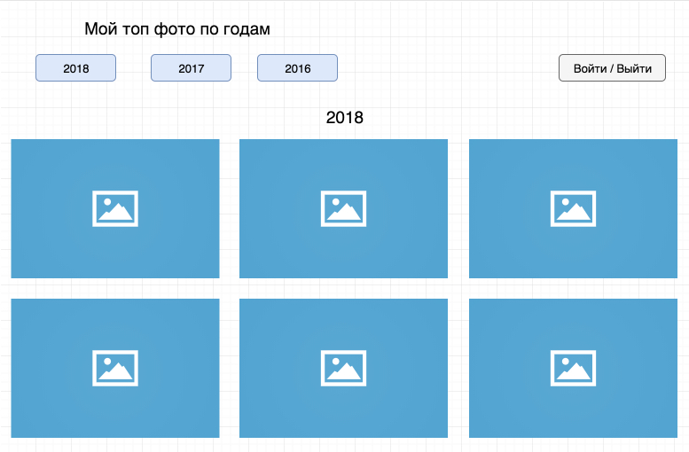

# React Redux

Версия от 2018 года включает в себя React `^16.4.1` (без проблем апгрейдится до `16.4.3`) и Redux `^4.0.0`

Курс предполагает, что читатель уже знаком с React. Если вы не знакомы, рекомендую для начала ознакомиться с курсом [React.js для начинающих](../handbook/tutorial.md).

В результате прохождения курса, вы научитесь:

- Основам создания SPA-приложения на React;
- Грамотно готовить Redux-приложение (однонаправленный поток данных);
- Выполнять асинхронные запросы (прелоадер, обработка ошибок) с помощью стандартного redux-thunk;
- Взаимодействовать со сторонними API (на примере [VK API](https://vk.com/dev/methods));
- Работать с документацией (по-желанию);
- Оптимизировать перерисовки компонентов;

Результатом изучения будет приложение, которое выведет ваши фото из VK отсортированные по лайкам с фильтром по году.



Создание

Я предлагаю по шагам создать одностраничное приложение, с минимумом функций, которое после логина в VK и подтверждения прав доступа к фото, будет выдавать топ ваших "залайканных" фото в порядке убывания. Схематично, приложение можно представить следующим образом:



Прежде чем описывать структуру, давайте в общих чертах взглянем на Redux.

Redux - приложение это:

- состояние (store) приложения в одном месте;
- однонаправленный поток данных: случился action -> редьюсер по команде "фас" отработал и вернул новое состояние -> компонент(ы) обновились;

Redux вдохновлен [Flux](https://facebook.github.io/flux/) методологией и языком программирования [Elm](https://elm-lang.org/).

Под капотом, Redux использует старую фичу реакта - context, которая обрела вторую жизнь в версии реакта 16.3 - "[New context API](../handbook/context.md)".

Есть старый context, который использует Redux, и есть новое Context API, не путайте.

## Файлы и папки

Изначально наше приложение в файловом менеджере должно выглядеть так (создайте недостающие директории в `src`):

```
+-- src
|   +-- actions
|   +-- components
|   +-- containers
|   +-- reducers
|   +-- utils
+-- файлы-от-create-react-app
+-- ...
```

Для обучения мы будем использовать очень распространенный подход организации файлов: деление на контейнеры и компоненты + экшены и редьюсеры в отдельных директориях.

Источник: [redux-course-ru-v2](https://maxfarseer.gitbooks.io/redux-course-ru-v2/content/)
