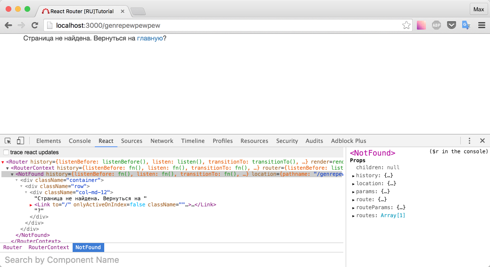
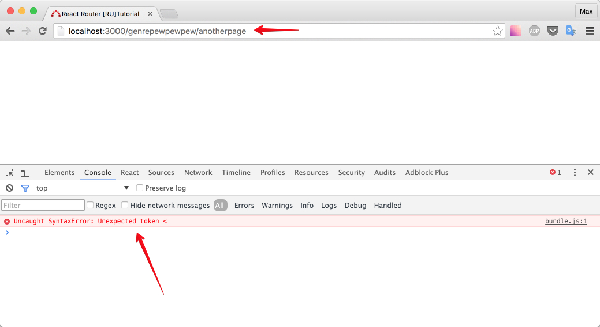
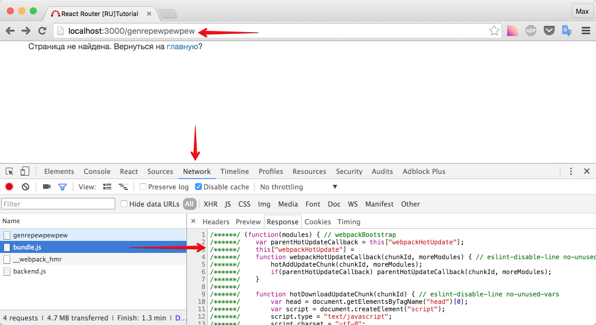
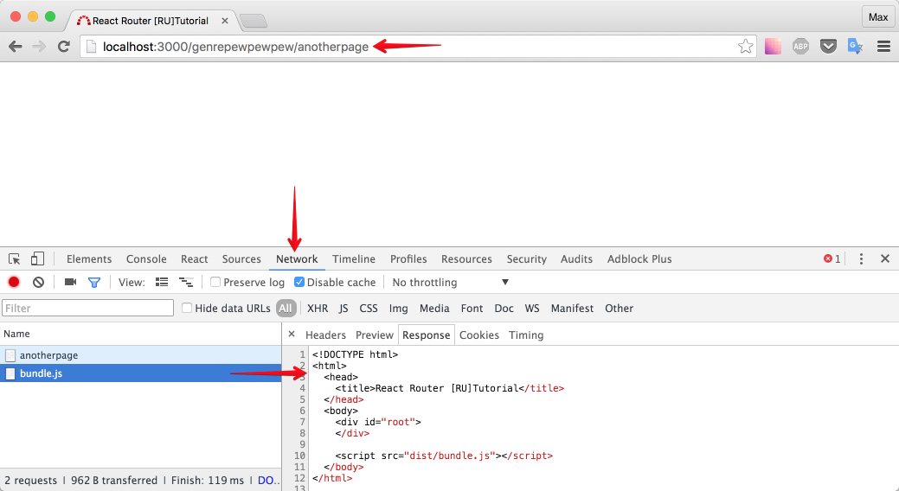
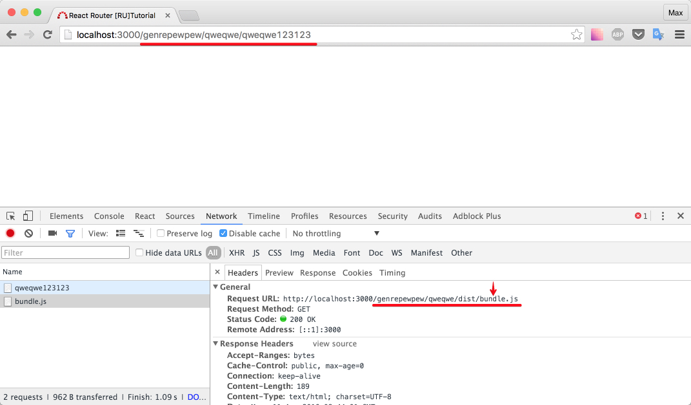
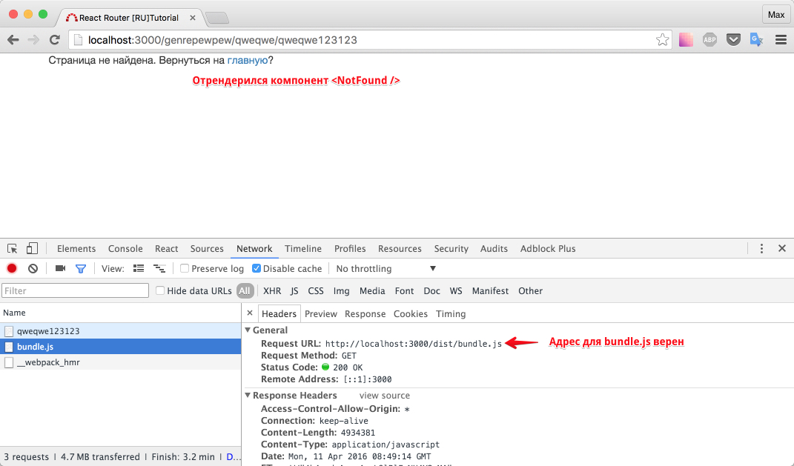

# BrowserHistory vs HashHistory

До текущего времени мы использовали `browserHistory` (смотри `src/index.js`).

Можно использовать и `hashHistory`. Замените в `src/index.js` все вхождения `browserHistory` на `hashHistory`, откройте снова `localhost:3000`, видите в адресе `#`? Покликайте по ссылкам.


"Мусор" в адресе используется так сказать, для того чтобы приблизиться к нативному поведению браузера. Что-то вроде уникального ключа. (дословно [здесь](https://github.com/reactjs/react-router-tutorial/tree/master/lessons/02-rendering-a-route) (EN)).

Спрашивается, зачем нам `hashHistory`? Ответ простой - если использовать `hashHistory`, придется меньше телодвижений делать для настройки роутинга на сервере. Давайте вернемся к `browserHistory`, а так же добавим компонент `<NotFound />`.

_src/components/NotFound.js_

```js
import React, { Component } from 'react'
import { Link } from 'react-router'

export default class NotFound extends Component {
  render() {
    return (
      <div className="container">
        <div className="row">
          <div className="col-md-12">
            Страница не найдена. Вернуться на <Link to="/">главную</Link>?
          </div>
        </div>
      </div>
    )
  }
}
```

Добавим `<NotFound />` в список роутов:

```js
import 'babel-polyfill'
import React from 'react'
import { render } from 'react-dom'
import App from './containers/App'
import Admin from './components/Admin'
import Genre from './components/Genre'
import Home from './components/Home'
import NotFound from './components/NotFound'

import { Router, Route, IndexRoute, browserHistory } from 'react-router'

render(
  <Router history={browserHistory}>
    <Route path="/" component={App}>
      <IndexRoute component={Home} />
      <Route path="admin" component={Admin} />
      <Route path="genre" component={Genre} />
    </Route>
    {/* для всех остальных роутов: показывай NotFound */}
    <Route path="*" component={NotFound} />
  </Router>,
  document.getElementById('root')
)
```

Попробуйте открыть `http://localhost:3000/genrepewpewpew`



А теперь - `http://localhost:3000/genrepewpewpew/anotherpage`



Почему? Зайдите на вкладку Network и проверьте, что отдает сервер внутри `bundle.js`

Корректный `bundle.js` для `http://localhost:3000/genrepewpewpew`



Некорректный `bundle.js` для `http://localhost:3000/genrepewpewpew/anotherpage`



Как думаете, в чем проблема?

Ответ кроется во фразе: "нам придется меньше телодвижений делать для настройки роутинга на сервере". Посмотрите сами

_server.js_

```js
app.get(/.*/, function root(req, res) {
  res.sendFile(__dirname + '/index.html')
})
```

Переведем написанное: на все запросы отдавай `index.html`. Код `index.html` предельно прост:

_index.html_

```html
<!DOCTYPE html>
<html>
  <head>
    <title>React Router [RU]Tutorial</title>
  </head>
  <body>
    <div id="root"></div>

    <script src="dist/bundle.js"></script>
  </body>
</html>
```

Тем не менее, здесь допущена ошибка! Используется относительный путь для файла `bundle.js`, снова посмотрим в консоль хрома:



К счастью, такую ошибку легко исправить, и мы по прежнему можем лицезреть красивый вид адресов, используя `browserHistory`.

_index.html_

```html
<!DOCTYPE html>
<html>
  <head>
    <title>React Router [RU]Tutorial</title>
  </head>
  <body>
    <div id="root"></div>
    <!-- добавим / в пути к bundle.js -->
    <script src="/dist/bundle.js"></script>
  </body>
</html>
```

Не забудьте перезапустить webpack, так как `index.html` не находится под наблюдением для пересборки.

Проверьте куда уходит запрос для `bundle.js` сейчас и убедитесь, что путь верен. Убедитесь, что в случае неправильного адреса показывается компонент `<NotFound />`.



[Альтернативное мнение](http://jamesknelson.com/push-state-vs-hash-based-routing-with-react-js/) James K Nelson'a: не нужно использовать pushState (а следовательно browserHistory).

P.S. James [предлагает](http://jamesknelson.com/routing-with-raw-react/) вообще не использовать `react-router`, но нам же нужно что-то разбирать в этом туториале ;)

Итого: `browserHistory` требует большей поддержки на сервере, но url-адрес выглядит симпатичнее.

[Исходный код](https://github.com/maxfarseer/react-router-ru-tutorial/tree/browserHistory_vs_hashHistory) на данный момент.
