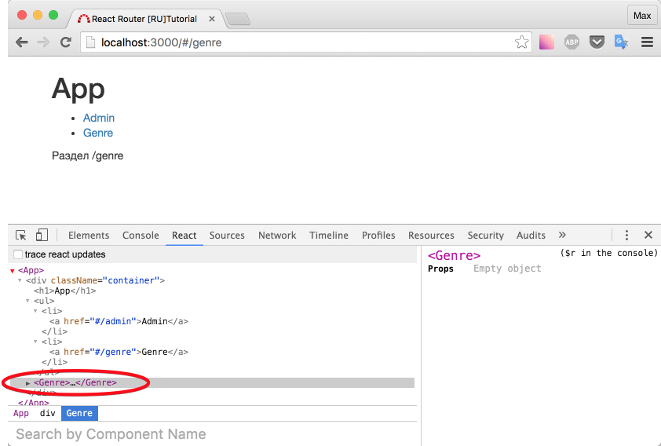

# Создаем примитивный роутер

Для создания этого раздела я не стал выдумывать "велосипед" и взял пример из [офф. документации](https://github.com/reactjs/react-router/blob/latest/docs/Introduction.md) подправив его под наши нужды.

Что есть роутинг в простом варианте? Соответствие URL-адреса некоему состоянию нашего приложения. Скорее всего: соответствие адреса "рендеру" (render) какого-то ключевого компонента.

Сейчас, мы будем изменять лишь часть URL-адреса (после #). Для прослушивания такого рода изменений, воспользуемся событием [hashchange](https://developer.mozilla.org/en-US/docs/Web/Events/hashchange).

Создадим три одинаковых компонента:

_src/components/Admin.js_

```js
import React, { Component } from 'react'

export default class Admin extends Component {
  render() {
    return (
      <div className="row">
        <div className="col-md-12">Раздел /admin</div>
      </div>
    )
  }
}
```

_src/components/Genre.js_

```js
import React, { Component } from 'react'

export default class Genre extends Component {
  render() {
    return (
      <div className="row">
        <div className="col-md-12">Раздел /genre</div>
      </div>
    )
  }
}
```

_src/components/Home.js_

```js
import React, { Component } from 'react'

export default class Home extends Component {
  render() {
    return (
      <div className="row">
        <div className="col-md-12">Раздел /</div>
      </div>
    )
  }
}
```

Добавим логики в компонент `<App />`, чтобы если хэш (часть URL-адреса после `#`) равна `/admin` - показывай содержимое компонента `<Admin />`, если равна `/genre` - `<Genre />`, иначе показывай содержимое `<Home />`.

_src/containers/App.js_

```js
import React, { Component } from 'react'
import Admin from '../components/Admin'
import Genre from '../components/Genre'
import Home from '../components/Home'

export default class App extends Component {
  constructor(props) {
    super(props)
    this.state = {
      route: window.location.hash.substr(1)
    }
  }
  componentDidMount() {
    window.addEventListener('hashchange', () => {
      this.setState({
        route: window.location.hash.substr(1)
      })
    })
  }
  render() {
    let Child

    switch (this.state.route) {
      case '/admin':
        Child = Admin
        break
      case '/genre':
        Child = Genre
        break
      default:
        Child = Home
    }

    return (
      <div className="container">
        <h1>App</h1>
        <ul>
          <li>
            <a href="#/admin">Admin</a>
          </li>
          <li>
            <a href="#/genre">Genre</a>
          </li>
        </ul>
        <Child />
      </div>
    )
  }
}
```

Покликайте ссылки. Никакой магии в очередной раз.

В момент `componentDidMount` мы подписались на прослушивание события изменения hash-части URL-адреса. Изменяя `state` мы вызываем ре-рендер (повторный рендер) компонента и поэтому в переменной `Child` оказывается нужное значение. Таким образом запись `<Child />` превращается в `<Admin />`, `<Genre />` или `<Home />` соответственно.



Обратите внимание, корректная запись именно `<Child />`, а не `<{Child} />`.

Итого: Мы разобрали процесс реализации примитивного роутинга в react-приложении.

[Исходный код](https://github.com/maxfarseer/react-router-ru-tutorial/tree/create_simple_router) на данный момент.
