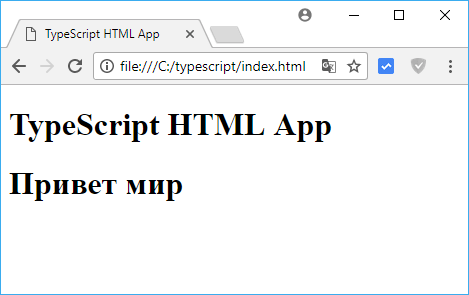

<!-- prettier-ignore-start -->
# Заголовочные файлы для популярных библиотек
{: .no_toc }
<!-- prettier-ignore-end -->

В прошлой теме было рассмотрено использование декларативных заголовочных файлов для внешнего кода на javascript. Однако, как правило, нам приходится взаимодействовать с крупными библиотеками, например, jquery, angularjs, extjs и так далее. Если мы хотим использовать функционал этих библиотек в коде на TS, то для них надо создать свои файлы определений.

<!-- prettier-ignore -->
1. TOC
{:toc}

И это может быть довольно утомительно в виду сложности библиотек и больших объемов кода. Но в сообществе TypeScript возникла идея создать общий репозиторий для подобных файлов, чтобы не надо было заново определять свои файлы, а можно бы было взять уже готовые. Этот репозиторий расположен на гитхабе: [https://github.com/DefinitelyTyped/DefinitelyTyped/](https://github.com/DefinitelyTyped/DefinitelyTyped/)

Как использовать js-библиотеки и заголовочные файлы для них? Во-первых, создадим в проекте каталог `Scripts`, который будет предназначен для хранения библиотек на javascript. Например, мы хотим использовать библиотеку jquery. На данный момент это версия jquery 3.3.1.

Создадим в проекте каталог `@types`, а в нем - подкаталог `jquery`. То есть в итоге проект будет выглядеть следующим образом:


В каталог `@types/jquery` поместим заголовочный файл для jquery - `index.d.ts`, который можно найти [по адресу](https://raw.githubusercontent.com/DefinitelyTyped/DefinitelyTyped/master/types/jquery/index.d.ts).

В корневой папке проекта определим следующую веб-страницу `index.html`:

```html
<!DOCTYPE html>
<html>
  <head>
    <meta charset="utf-8" />
    <title>TypeScript HTML App</title>
  </head>
  <body>
    <h1>TypeScript HTML App</h1>

    <div id="content"></div>
    <script src="https://code.jquery.com/jquery-3.3.1.min.js"></script>
    <script src="app.js"></script>
  </body>
</html>
```

Здесь только подключается библиотека jquery из cdn, а также файл нашего приложения - `app.js`.

Далее в корневой папке проекта определим следующий файла `app.ts`:

```typescript
/// <reference path="@types/jquery/index.d.ts" />

$(document).ready(() => {
  $('#content').html('<h1>Привет мир</h1>')
})
```

В данном случае мы задействуем событие `document.ready`, которое определено в jquery и которое срабатывает при загрузке документа. И далее с помощью лямбда-выражения, которое определяет функцию обратного вызова, с помощью знакомого многим синтаксиса jquery на веб-страницу добавляется новый элемент.

Также мы могли бы использовать сокращенное определение функции:

```typescript
$(() => {
  $('#content').html('<h1>Привет мир</h1>')
})
```

В итоге при запуске веб-страницы `index.html` сработает код из файла `app.ts`:



Для примера еще обработаем событие нажатия кнопки. Допустим, в html-коде страницы есть такая кнопка:

```html
<button id="alertBtn">Жми</button>
```

В коде на TS мы могли бы так обработать нажатия на эту кнопку:

```typescript
$(() => {
  $("#alertBtn").click((e) => { \$("#content").html("<h2>Привет мир</h2>"); });
});
```

Обработчики событий, например, `click` в качестве параметра также принимают лямбда-выражение, которое определяет набор инструкции, выполняемых при нажатии.

## Ссылки

- [Заголовочные файлы для популярных библиотек](https://metanit.com/web/typescript/4.2.php)
