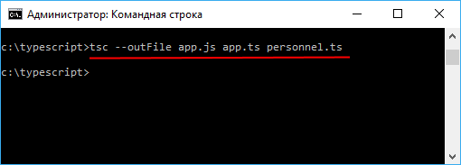

# Пространства имен

Для организации больших программ предназначены пространства имен. Пространства имен содержат группу классов, интерфейсов, функций, других пространств имен, которые могут использоваться в некотором общем контексте.

Для определения пространств имен используется ключевое слово `namespace`:

```typescript
namespace Personnel {
  export class Employee {
    constructor(public name: string) {}
  }
}
```

В данном случае пространство имен называется `Personnel`, и оно содержит класс `Employee`. Чтобы типы и объекты, определенные в пространстве имен, были видны извне, они определяются с ключевым словом `export`. В этом случае во вне мы сможем использовать класс `Employee`:

```typescript
namespace Personnel {
  export class Employee {
    constructor(public name: string) {}
  }
}

let alice = new Personnel.Employee('Alice')
console.log(alice.name) // Alice
```

При этом пространства имен могут содержать и интерфейсы, и объекты, и функции:

```typescript
namespace Personnel {
  export interface IUser {
    displayInfo()
  }

  export class Employee {
    constructor(public name: string) {}
  }

  export function work(emp: Employee): void {
    console.log(emp.name, 'is working')
  }

  export let defaultUser = { name: 'Kate' }
}

let tom = new Personnel.Employee('Tom')
Personnel.work(tom) // Tom is working

console.log(Personnel.defaultUser.name) // Kate
```

## Пространство имен в отдельном файле

Нередко пространства имен определяются в отдельных файлах. Например, определим файл `personnel.ts` со следующим кодом:

```typescript
namespace Personnel {
  export class Employee {
    constructor(public name: string) {}
  }
  export class Manager {
    constructor(public name: string) {}
  }
}
```

И в той же папке определим главный файл приложения `app.ts`:

```typescript
/// <reference path="personnel.ts" />

let tom = new Personnel.Employee('Tom')
console.log(tom.name)

let sam = new Personnel.Manager('Sam')
console.log(sam.name)
```

С помощью директивы `/// <reference path="personnel.ts" />` подключается файл `personnel.ts`.

Далее нам надо объединить оба файла в один файл, который затем можно подключать на веб-страницу. Для этого при компиляции указывается опция:

```typescript
--outFile target.js sourse1.ts source2.ts source3.ts ...
```

Опции `outFile` в качестве первого параметра передается название файла, который будет генерироваться. А последующие параметры - файлы с кодом TypeScript, которые будут компилироваться.

То есть в данном случае нам надо выполнить в консоли команду

```bash
tsc --outFile app.js app.ts personnel.ts
```



В итоге будет создан один файл `app.js`.

## Вложенные пространства имен

Пространства имен могут быть вложенными:

```typescript
namespace Data {
  export namespace Personnel {
    export class Employee {
      constructor(public name: string) {}
    }
  }
  export namespace Clients {
    export class VipClient {
      constructor(public name: string) {}
    }
  }
}

let tom = new Data.Personnel.Employee('Tom')
console.log(tom.name)

let sam = new Data.Clients.VipClient('Sam')
console.log(sam.name)
```

Причем вложенные пространства имен определяются со словом `export`. Соответственно при обращении к типам надо использовать все пространства имен.

## Псевдонимы

Возможно, нам приходится создавать множество объектов `Data.Personnel.Employee`, но каждый раз набирать полное имя класса с учетом пространств имен, вероятно, не всем понравиться, особенно когда модули имеют глубокую вложенность по принципу матрешки. Чтобы сократить объем кода, мы можем использовать псевдонимы, задаваемые с помощью ключевого слова `import`. Например:

```typescript
namespace Data {
  export namespace Personnel {
    export class Employee {
      constructor(public name: string) {}
    }
  }
}

import employee = Data.Personnel.Employee
let tom = new employee('Tom')
console.log(tom.name)
```

После объявления псевдонима `employee` будет рассматриваться как краткое имя для `Data.Personnel.Employee`.

## Ссылки

- [Пространства имен](https://metanit.com/web/typescript/3.6.php)
