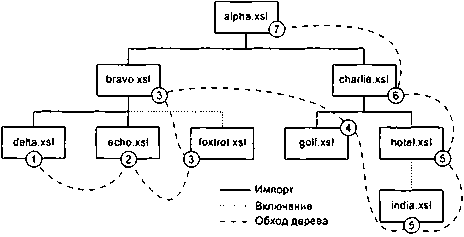

# xsl:import

Импорт преобразований, который обеспечивается элементом **`xsl:import`** является одним из способов использования внешних модулей в XSLT.

Импорт преобразований более сложен, чем их простое [включение](xsl-include.md) — последовательность импорта модулей может влиять на то, как будет выполняться преобразование. Равно как и в случае с [`xsl:include`](xsl-include.md), условное импортирование преобразований не разрешено.

## Синтаксис

```xml
<xsl:import
	href = "URI" />
```

Атрибуты:

**`href`**
: **обязательный** атрибут, содержит URI внешнего модуля, который должен быть импортирован в текущее преобразование.

## Описание и примеры

Синтаксис импорта преобразования практически полностью аналогичен включению: обязательный атрибут `href` содержит URI внешнего модуля, который должен быть импортирован в текущее преобразование. Так же, как и в случае с [`xsl:include`](xsl-include.md), элемент `xsl:import` логически заменяется содержимым внешнего модуля, и относительные идентификаторы ресурсов (URI), используемые во внешнем преобразовании, отсчитываются от его базового адреса. Преобразование не может прямо или косвенно импортировать само себя.

> Совет.
> Не следует импортировать или включать в преобразование больше кода, чем необходимо. Если в одном импортируемом модуле находится много разнородных шаблонов, определений и так далее, лучше разбить этот модуль на несколько более мелких. Половина модуля загружается быстрее, чем модуль целиком. При этом целый модуль загружается быстрее, чем две его половины по отдельности.

Главным отличием импорта преобразований является то, что последовательность импортирования внешних модулей, называемая порядком импорта оказывает влияние на приоритет исполнения шаблонов, определения и многое другое.

### Порядок импорта

Как уже было сказано выше, элементы `xsl:import` должны всегда быть первыми дочерними элементами `xsl:stylesheet`. Порядок, в котором они находятся в преобразовании, определяет порядок импорта внешних модулей следующим образом.

- Порядок импорта основного преобразования всегда старше порядка импорта внешнего преобразования.
- В случае, если преобразование импортирует несколько внешних модулей, порядок импорта преобразований, которые импортируются раньше, младше порядка импорта последующих модулей.
- Порядок импорта преобразования, включенного в основное при помощи элемента xsl:include, равен порядку импорта основного преобразования.

Эти правила могут быть проиллюстрированы следующими примерами.

Рассмотрим преобразование `alpha.xsl`, которое импортирует преобразования `bravo.xsl` и `charlie.xsl` и включает преобразование `delta.xsl`.

Листинг 4.14. Фрагмент преобразования `alpha.xsl`

```xml
<xsl:stylesheet version="1.0" xmlns:xsl="http://www.w3.org/1999/XSL/Transform">
    <xsl:import href="bravo.xsl"/>
    <xsl:import href="charlie.xsl"/>
    <xsl:include href="delta.xsl"/>
    <!-- ... -->
</xsl:stylesheet>
```

В соответствии с первым правилом, порядок импорта основного преобразования старше порядка импорта внешних модулей, значит `alpha.xsl` старше `bravo.xsl` и `charlie.xsl`. Далее, согласно второму правилу порядок импорта преобразования `bravo.xsl` младше порядка `charlie.xsl`, поскольку оно импортируется первым. Преобразование `delta.xsl` будет иметь порядок импорта такой же, как и у основного преобразования `alpha.xsl`. Таким образом, порядок импорта в этом примере будет иметь следующий вид:

- bravo.xsl
- charlie.xsl
- alpha.xsl delta.xsl

Преобразование `bravo.xsl` будет самым младшим, а преобразования `alpha.xsl` и `delta.xsl` — самыми старшими.

Заметим, что импортируемые преобразования могут и сами импортировать другие модули. В этих случаях вычисление порядка импорта несколько усложняется.

Техническая рекомендация XSLT предлагает решать эту проблему построением логического дерева импорта.

Пример

Рассмотрим следующую схему включений и импорта (табл 4.1).

Таблица 4.1. Включение и импорт преобразований

<table class="table">
<tr><th>Преобразование</th><th>Импортирует</th><th>Включает</th></tr>
<tr><td>alpha.xsl</td><td>bravo.xsl charlie.xsl</td><td></td></tr>
<tr><td>bravo.xsl</td><td>delta.xsl echo.xsl</td><td>foxtrot.xsl</td></tr>
<tr><td>charlie.xsl</td><td>golf.xsl hotel.xsl</td><td></td></tr>
<tr><td>hotel.xsl</td><td></td><td>india.xsl</td></tr>
</table>

Этой схеме будет соответствовать логическое дерево импорта на рис. 4.1.

Рис. 4.1. Обход дерева импорта преобразований



В соответствии с правилами, левые ветки дерева будут младше правых, вершины, находящиеся ближе к корню, будут старше тех, которые дальше от него, включенные преобразования имеют тот же приоритет, что и у родителей.

Таким образом, порядок импорта преобразований от младших к старшим будет выглядеть следующим образом:

- delta.xsl
- echo.xsl
- bravo.xsl foxtrot.xsl
- golf.xsl
- hotel.xsl india.xsl
- charlie.xsl
- alpha.xsl

Порядок, в котором импортируются модули, непосредственным образом влияет на различные аспекты преобразования. Эффект, который оказывает порядок импорта на те или иные элементы, будет подробно описан при их рассмотрении — сейчас же мы их просто коротко перечислим.

- [`xsl:attribute-set`](xsl-attribute-set.md) — порядок импорта используется для определения главенства элементов [`xsl:attribute`](xsl-attribute.md), включенных в разные именованные списки атрибутов, но создающих атрибуты с одинаковыми именами.
- [`xsl:namespace-alias`](xsl-namespace-alias.md) — в случае, если в преобразовании определяются несколько псевдонимов префиксов пространств имен, процессор использует самый старший в порядке импорта псевдоним.
- [`xsl:output`](xsl-output.md) — эти элементы объединяются процессором. В случае конфликтов, например, когда в разных элементах `xsl:output` атрибуты определены по-разному, процессор должен использовать старшее в порядке импорта определение.
- [`xsl:strip-space`](xsl-strip-space.md) и [`xsl:preserve-space`](xsl-preserve-space.md) — в этих элементах порядок импорта также используется для разрешения конфликтов: выигрывают определения со старшим порядком импорта.
- [`xsl:template`](xsl-template.md) — порядок импорта используется для разрешения конфликтов, которые возникают в случаях, когда один узел может быть обработан несколькими шаблонами. Шаблон, содержащийся в преобразовании с младшим порядком импорта, будет просто исключен из рассмотрения.
- [`xsl:variable`](xsl-variable.md) и [`xsl:param`](xsl-param.md) — порядок импорта используется при обращении к глобальным переменным в случае, если в разных преобразованиях существуют разные определения переменной с одним именем. В подобной ситуации будет использована переменная со старшим порядком импорта.

## См. также

- [`xsl:include`](xsl-include.md) -- включение внешнего преобразования.
- [`xsl:apply-imports`](xsl-apply-imports.md) -- используется в шаблонах для применения правил, которые были импортированы во внешних модулях.

## Ссылки

- [`xsl:import`](https://developer.mozilla.org/en/XSLT/import) на MDN
- [`xsl:import`](https://msdn.microsoft.com/en-us/library/ms256126.aspx) на MSDN
